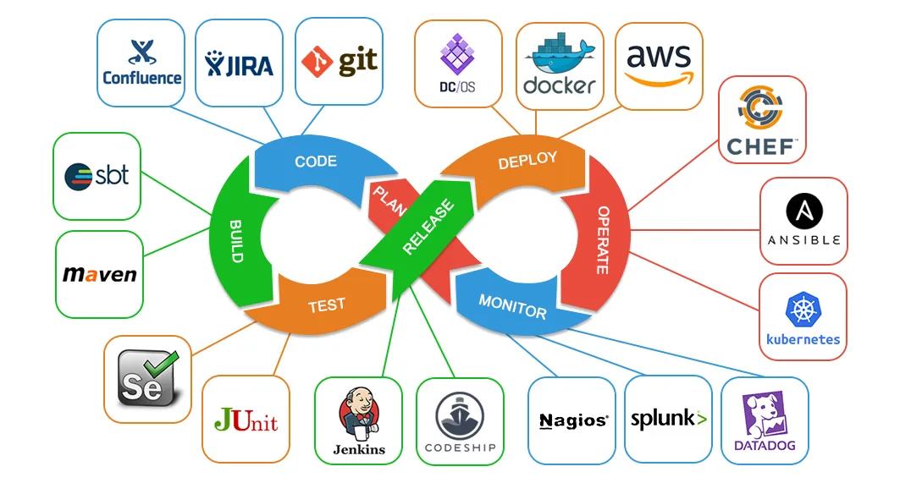

# O que é DevOps?

- `Dev` (Development, Desenvolvimento): Equipes que atuam no desenvolvimento das aplicações e funcionalidades.
  - Implementam novas funcionalidades;
  - São avaliados pela quantidade de linhas de código que entregam (além da qualidade);
  - Buscam mudanças constantemente;
  - Realizam entregas baseados nas exigências dos clientes;

- `Ops` (Operations, Operações): Equipes que atuam no monitoramento e na manutenção da saúde (funcionamento e infraestrutura) das aplicações que encontram-se em produção.
  - Prezam pela estabilidade;
  - Procuram identificar e solucionar possíveis falhas que venham a comprometer o funcionamento das aplicações;
  - Atuam dentro de um SLA (Service Level Agreement), isto é, eles possuem um tempo pré estabelecido em contrato para realizem uma determinada tarefa.

- Podemos perceber que essas duas áreas são conflitantes, já que uma procura mudança/evolução constante, enquanto a outra preza pela estabilidade. O movimento/cultura DevOps surge como uma iniciativa para "derrubar o muro" entre essas áreas para que elas possam atuar juntar da maneira mais harmônica possível, ou seja, com desenvolvimento e entrega otimizados e de qualidade, sem afetar a estabilidade, desempenho e disponibilidade das aplicações.

- Objetivos:
  - Melhor colaboração;
  - Melhor qualidade;
  - Diminuir o tempo de entregas;
  - Entregas mais seguras.

- Origem do mundo Ágil.

- Tecnologias utilizadas:
  - Virtualização e containerização;
  - Infraestrutura como código;
  - Integração e entrega contínua (Criação de pipelines para deploy automático do código);
  - Ferramentas de monitoramento e análise.

- Exemplos de ferramentas utilizadas:

  

- Muitas vezes essas áreas são unidas em uma só, sendo necessário profissionais que tenham noção tanto de desenvolvimento quanto de infraestrutura.

- Desenvolvedores que conhecem o local onde o seu código será executado tendem a escrever códigos melhores.