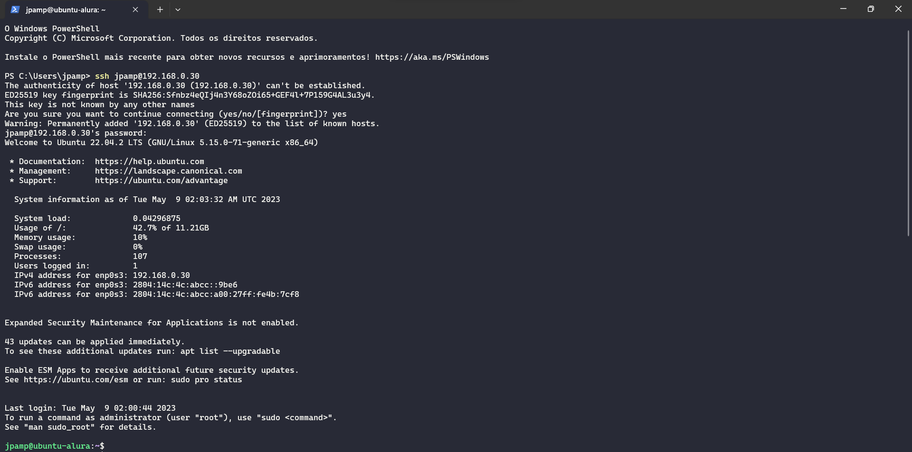

# Linux

- É muito importante aprender sobre Linux pois eles possuem grande importância na construção do back-end das soluções que compõe a Internet.

- Há diferentes distribuições disponíveis para uso de acordo com as demandas de aplicações e usuários. A seleção de uma determinada distribuição deve levar em conta os objetivos e preferências de uso.

- Principais distribuições/sabores (*flavours*) existentes:
  - Ubuntu;
  - Debian;
  - Red Hat;
  - Fedora;
  - CentOS;
  - Suse;
  - Gentoo.


- LTS (*Long Term Support*): Versões que possuirão suporte por bastante tempo.

- Para questões de aprendizado, podemos utilizar o Linux instalando ele diretamente na nossa máquina, como Sistema Operacional principal, ou através de virtualização (Máquinas Virtuais ou Containers Docker).

## :one: Servidor Linux

- No curso, foi criado um servidor Linux, utilizando uma imagem do **Ubuntu Server** na versão `22.04.2`. Após instalá-lo, para descobrir seu endereço IP podemos utilizar o seguinte comando:

  ```Bash
    ip addr
  ```

  

  - A interface 1 é a de **LOOPBACK**, conhecida também como `127.0.0.1` ou `localhost`, muito acessada quando queremos acessar aplicações que estão rodando diretamente na nossa máquina.

  - Na interface 2, o endereço IP circulado em vermelho será utilizado para realizar o acesso a máquina de forma remota.

- Para permitir conexões via SSH, é necessário instalar a biblioteca `openssh-server`:

  ```Bash
    sudo apt-get install openssh-server
  ```

## :two: Gerenciador de Pacotes

- Para instalarmos bibliotecas no Sistema Operacional Linux, devemos manipular os gerenciadores de pacotes, utilizado para instalá-las, atualizá-las ou removê-las.
  - No caso da distribuição Ubuntu, o gerenciador de pacotes é o `apt-get`.

- Antes de instalar ou atualizar qualquer pacote, uma boa prática é realizar a atualização dos repositórios configurados na máquina:

  ```Bash
    sudo apt-get update
  ```

  - Quando realizamos esse comando, a máquina atualiza seu repositório local de bibliotecas com os repositórios remotos, assim, quando instalarmos uma nova ferramenta, a mesma será atualizada para a versão mais recente (há não ser que você defina qual versão deseja baixar).

- É possível alterar os repositório remotos.

## :three: Privilégios de Administrador

- Para executar determinados comandos (como por exemplo, manipulação do gerenciador de pacotes), é necessário inserir o comando `sudo` a frente do restante dos comandos.

- O comando `sudo` vem de *Super User Do*, ou em português, "Faça como administrador". Ele concede momentameamente privilégios de administrador para o usuário que está executando o comando (desde que esse usuário possa ter esse privilégio), assim como quando executamos o Prompt de Comando do Windows no modo Administrador.

- Uma boa prática é sempre utilizarmos usuários normais para realizar tarefas no sistema e utilizar o usuário `root` ou os privilégios de administrador quando de fato forem necessários.

## :four: Security Shell (SSH)

- Geralmente vamos utilizar um servidor Linux que está localizado em outra máquina e para isso, precisamos nos conectar a ela.

- O protocolo SSH é um protocolo que oferece acesso remoto seguro a máquinas e servidores, estabelecendo uma comunicação criptografada entre cliente e servidor, garantindo que os dados trafegádos entre essas duas pontas não possam ser interceptados.

- Para acessar uma máquina ou servidor, via SSH:

  ```BAT
    ssh <usuario>@<endereco_ip> [options]
  ```

  

- É possível passar *flags* ou *options* para alterar o comportamento do comando SSH. Entre as mais famosas estão:
  - `-p`: Permite alterar a porta em que será realizada a conexão. Por padrão, o SSH utiliza a porta 22;
  - `-i`: Permite indicar o arquivo que armazena a chave SSH para realizar a autenticação.

- Para finalizar a conexão, utilizamos o comando `exit`.

## :five: Anatomia do Terminal


- `jpamp`: Nome do usuário conectado;
- `ubuntu-alura`: Hostname da máquina ao qual o usuário está conectado;
- `~`: Indica a pasta de trabalho atual (nesse caso, esse símbolo representa a pasta do usuário em `/home`);
- `$`: Indica que o usuário em questão não possui privilégios de administrador. Caso possuísse, o símbolo apresentado seria o `#`.

## :six: Comandos de Navegação

- Para descobri o diretório de trabalho atual:

  ```Bash
    pwd
  ```

  - Esse comando retorna o caminho absoluto para o diretório de trabalho atual, isto é, o caminho entre o diretório raiz do sistema `/` e o atual.

- Listar os conteúdos de um diretório:

  ```Bash
    ls
  ```

  - Podemos utilizar parâmetros para alterar o formato da saída do comando:
    - `-a`: Listar todos os arquivos existentes no diretório, mesmo aqueles que começam com `.` (arquivos ocultos);
    - `-l`: Listar todos os arquivos existentes no diretório com detalhes (permissões, *owner* e grupo do arquivo, tamanho em bytes, etc.).

- O Linux possui uma estrutura de diretórios padrão conhecida como *Filesystem Hierarchy Standard* (FHS):

  

  - Assim como o `C:` é a pasta raiz nos sistemas operacionais Windows, a `/` é o diretório raiz dos sistemas *Unix Like*.

- Para alterarmos o diretório de trabalho:

  ```Bash
    cd <destino>
  ```

  - O destino pode ser um caminho **absoluto** ou **relativo**, onde o primeiro representa o caminho para o diretório de destino a partir do diretório raiz, enquanto o segundo é o caminho entre o diretório atual de trabalho e o de destino. Exemplo:

    1. O diretório atual de trabalho encontra-se em `/home/jpamp/documentos/faculdade`;
    2. O diretório de destino encontra-se em `/mnt/pendrive/fotos/viagem`;
    3. Para acessar o destino utilizando o caminho absoluto, escrevemos: `cd /mnt/pendrive/fotos/viagem`;
    4. Para acessar o destino utilizando o caminho relativo, escrevemos: `cd ../../../mnt/pendrive/fotos/viagem`;

  - Para ir direto para o diretório do nosso usuário em `/home`, digitamos `cd` ou `cd ~`, independentemente do diretório de trabalho atual;
  - O valor `..` faz referência ao diretório hierarquicamente acima do diretório de trabalho atual. Exemplo:

    1. O diretório atual de trabalho encontra-se em `/home/jpamp/documentos`;
    2. Executamos o comando `cd ..`;
    3. Agora, o diretório de trabalho atual é o `/home/jpamp`.

  - Assim como podemos utilizar o `..` para referenciar o diretório hierarquicamente acima, podemos utilizar o `.` para referenciar o diretório atual;
  - O comando `cd -` retorna ao diretório anterior. Exemplo:

    1. O diretório atual é o `/etc`;
    2. Executamos o comando `cd /var/log` para mudar de diretório;
    3. Se executarmos `cd -`, dentro de `/var/log`, voltamos para `/etc`, pois foi o último diretório visitado antes do atual.

## :seven: Manual dos Comandos

- Para entender o funcionamento de um comando e os parâmetros existentes, podemos consultar sua documentação:

  ```Bash
    <comando> --help
  ```

  ou

  ```Bash
    man <comando>
  ```

## :eight: Manipulando Arquivos e Diretórios

### :arrow-right: Criar

- Para criar um arquivo:

  ```Bash
    touch <nome_arquivo>
  ```

  - É possível criar vários arquivos de uma só vez:

    ```Bash
      touch <nome_arquivo_1> <nome_arquivo_2> ... <nome_arquivo_n>
    ```

- Para criar um diretório:

  ```Bash
    mkdir <nome_diretorio>
  ```

  - É possível criar diretórios de forma aninhada utilizando o parâmetro `-p`:

    ```Bash
      mkdir <nome_diretorio_1>/<nome_diretorio_2>/<nome_diretorio_3>/...
    ```

    - No exemplo acima, o diretório 1 será criado na pasta corrente, o diretório 2 será criado dentro do 1, o diretório 3 será criado dentro do 2, e assim em diante...

- Para criarmos arquivos e diretórios com nomes contendo espaços, devemos utilizar a contrabarra. Exemplo:

  ```Bash
    mkdir diretorio\ 1
  ```

### :arrow-right: Remover

- Para remover um arquivo:

  ```Bash
    rm <nome_arquivo>
  ```

- Para remover um diretório:

  ```Bash
    rmdir <nome_diretorio>
  ```

  - Podemos remover diretórios utilizando o comando `rm`, desde que insiramos o parâmetro `-r`, de recursividade;
  - Se tentarmos apagar um diretório que possui conteúdos, o terminal irá reclamar e impedir a realização da operação. Para forçar a deleção, utilizamos o parâmetro `-f`. Tomar cuidado com esse parâmetro, pois uma vez deletados, os conteúdos não podem ser recuperados.

### :arrow-right: Copiar

- Para copiar tanto arquivos quanto diretórios:

  ```Bash
    cp <origem> <destino>
  ```

  - Para copiarmos diretórios, devemos utilizar o parâmetro `-r`, de recursividade.

- Se o destino for um diretório não existente, o mesmo será criado.

### :arrow-right: Mover e Renomear

- Para mover e renomear arquivos e diretórios, utilizamos o mesmo comando `mv`. O que vai diferenciar se ele está sendo utilizado para uma função ou outra é a origem e o destino passados como parâmetros.
  - Caso origem e destino sejam os mesmos, significa que desejamos renomear o arquivo. Caso origem e destino possuam caminhos diferentes, significa que desejamos realizar o deslocamento dos conteúdos selecionados.

  ```Bash
    mv <origem> <destino>
  ```

## :nine: Globbings

- Globbings, mais conhecidos como **caractéres Coringa**, permitem potencializar o uso do terminal.

- Seja o seguinte cenário, onde temos um diretório com os seguintes arquivos:

  ```Linux
    texto1.pdf 
    texto2.pdf 
    arq1 
    arq2 
    arq3
    arq8
    arq10
    arq20
    arq30
    arq100
    tmp1
    tmp2
  ```

  - Para listar apenas os arquivos com extensão `.pdf`:

    ```Bash
      ls *.pdf
    ```

    - Resultado:

      ```Linux Terminal
        texto1.pdf texto2.pdf
      ```
  
  - Para listar apenas os arquivos que começam com `arq` e que possuem apenas dois dígitos:

    ```Bash
      ls arq??
    ```

    - Resultado:

      ```Linux Terminal
        arq10 arq20 arq30
      ```

  - Para listar apenas os arquivos que possuem três caractéres, seguidos de um número entre 1 e 5:

    ```Bash
      ls ???[1-5]
    ```

    - Resultado:

      ```Linux Terminal
        arq1 arq2 arq3 tmp1 tmp2
      ```

  - Para listar apenas arquivos com possuam três caractéres, seguidos do número 1 ou 3:

    ```Bash
      ls ???[1,3]*
    ```

    - Resultado:

      ```Linux Terminal
        arq1 arq3 arq10 arq30 arq100 tmp1
      ```

- Dado os exemplos acima, podemos observar os seguintes caractéres coringa:

  | Caractére | Descrição |
  | :-------: | :-------: |
  | * | Qualquer coisa |
  | ? | Substitui um único caractére |
  | [-] | Determina um range de valores alfanuméricos |
  | [,] | Determina uma lista de possíveis valores |

- O Terminal Linux é *Case Sensitive*.
