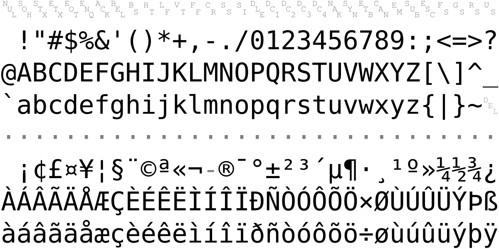

# Arquitetura de Computadores

## :one: Como o computador lê o seu código?

### :arrow-right: Linguagens

- As aplicações são desenvolvidas utilizando linguagens de programação, ao qual chamamos de **linguagens de alto nível**, como por exemplo, Java, Python, JavaScript, PHP, etc. Essa linguagens se assemelham a linguagem utilizada por nós humanos e costumeiramente são escritas em inglês.

- Porém, os computadores não são capazes de interpretar por si só essas linhas de códigos e executá-las, sendo necessário processos intermediários para realizar a tradução desse código para a linguagem conhecida pelas máquinas, a **binária**. Códigos binários são escritos em 0s e 1s que representam as ondas elétricas ao qual o hardware utiliza para entender, interpretar e executar as operações solicitadas pelo usuário.

- Mas a linguagem de alto nível não é traduzida diretamente para a linguagem binária. Existe uma **linguagem intermediária**, conhecida como **Assembly**, que é utilizada pelos processadores das máquinas, para poder realizar a interpretação das operações solicitadas pelos usuários, para assim realizar o procedimento de tradução para linguagem binária.
  - Para realizar a tradução da **linguagem de montagem** para a **linguagem de máquina**, é utilizada o **Assembler**, também conhecido como **montador**;
  - As linguagens de montagem costumam possuir apenas operações simples, o que em muitos casos torna atividade simples em um código de muitas linhas;
  - Imagina ter que desenvolver através de linguagem de montagem!
  - Cada processador possui sua própria linguagem de montagem;

- Exemplo de código em linguagem de alto nível (JavaScript):

  ```JavaScript
  let c = a + b;
  ```

- Exemplo de código em linguagem de montagem (Assembly):
  
  ```Assembly
  pega a
  soma b
  guarda c
  ```

### :arrow-right: Compiladores x Interpretadores

- O processo de tradução do código escrito em linguagem de alto nível para linguagem de máquina (binário) pode ser feito de duas formas: compilação e interpretação.

- Para entender esses dois processos, podemos fazer as seguintes analogias:
  - **Compilação:** Se assemelha ao processo de tradução de um livro. Há um livro que originalmente está escrito em inglês e que uma editora deseja traduzí-lo e disponibilizá-lo em língua portuguesa. Logo, será feita a tradução do  livro, gerando uma nova versão. Essa nova versão será disponibilizada no mercado, e caso alguém se interesse, poderá comprá-lo. Ao comprar o livro em português, o leitor não precisará da versão original em inglês para entender sobre o que o livro fala, pois todo conteúdo foi traduzido;
  - **Tradução:** Se assemelha ao processo de tradução em tempo real, por exemplo, quando um canal de televisão está transmitindo um evento internacional e sempre há um profissional responsável por traduzir tudo o que está sendo dito para a língua de conhecimento dos telespectadores.

- A execução de códigos escritos em linguagens compiladas possui duas etapas. A primeira etapa consiste na compilação do arquivo de código fonte, onde é feita toda a análise léxica, sintática e semântica do código. Caso erros sejam identificados, eles serão reportados nessa etapa. Ao final dessa etapa, um arquivo intermediário é gerado, sendo esse, o arquivo em linguagem de máquina. A segunda etapa consiste em executar esse arquivo.

- Por sua vez, códigos escritos em linguagens interpretadas, todo o processo de verificação de erros é feito em tempo de execução, isto é, o código é executado linha por linha e ao mesmo tempo vai ocorrendo o processo de análise para validar se o código está escrito corretamente.

- Esses processos possuem suas vantagens e desvantagens:

  | Compiladores | Interpretadores |
  | ------------ | --------------- |
  | Execução rápida | Execução lenta |
  | Verifica erros antes de executar | Só verifica erros executando |
  | Tempo extra para executar | Começa a executar na hora |
  | Executa em uma máquina | Executa em diferentes máquinas |

- Não necessariamente as linguagens que utilizam um dos processos de tradução são melhores do que as que utilizam o outro. Tudo vai depender das necessidades da sua aplicação. Exemplo: se a sua aplicação deve priorizar performance, utilizar uma linguagem compilada é uma melhor alternativa, uma vez que todo processo de análise já foi realizado na etapa anterior, enquanto as linguagens interpretadas vão perder um tempo a mais para fazer essa análise linha por linha.

- Códigos compilados só podem ser executados na mesma máquina pois o código foi traduzido utilizando o Assembler do processador específico daquela máquina. Caso a máquina mude, essa será incapaz de interpretar o código, pois seu montador é diferente. Códigos interpretados executam em qualquer máquina, pois a tradução pra linguagem de montagem é feita de forma online.

  | Linguagens Compiladas | Linguagens Interpretadas |
  | --------------------- | ------------------------ |
  | C, R, GO | JavaScript, Python, PHP, Ruby |

- Uma mesma linguagem pode ser tanto compilada quando interpretada. O compilador e o interpretador nada mais são do que a implementação das linguagens. Assim, podem existir diferentes implementações para uma mesma linguagem que utilizam cada uma dessas técnicas.

- Existem outras implementações que procuram obter a melhor característica de cada uma das forma de tradução:
  - **Just In Time (JIT) Compilation** é uma forma de tradução que procura compilar apenas trechos/funções que serão utilizados, isto é, o códigos é executado, e caso seja identificado que uma determinada função será executada, essa é totalmente compilada e então enviada para o processamento.
  - O **Java** possui um modelo de tradução híbrido, ou seja, ele é tanto um compilador quanto um interpretador. Ele foi criado com o intuito de resolver o problema de permitir executar um mesmo código em diferentes máquinas com sistemas operacionais diferentes. Para isso, o processo de tradução é feito em duas etapas.
    - Na primeira etapa, o código fonte é **compilado**, gerando um arquivo intermediário chamado **Bytecode** (também conhecido como arquivo `.class`). Com esse arquivo em mãos, o usuário pode inserí-lo em qualquer máquina, seja lá qual for o SO ou processador da máquina, que o mesmo será interpretado pela **Java Virtual Machine (JVM)**, executando o código.

## :two: Como o computador executa um programa?

- Os arquivos de nossa máquina são armazenados em diretórios (ou pastas), que encontram-se dentro de um sistema de arquivos, que é uma função do Sistema Operacional.

### :arrow_right: Memórias Não Voláteis

- Memórias Não Voláteis são aquelas cujo os dados armazenados não são perdidos assim que a máquina é desligada, em outra palavaras, assim que o hardware sofre um corte de fornecimento de energia.

- Essas memórias armazenam nossos arquivos que desejamos que estejam na máquina assim que a ligarmos.

- Existem dois métodos popularmente utilizados nos dias de hoje para o armazenamento consistente: **HD** (Hard Disk, ou Disco Rígido) e o **SSD** (Solid State Drive, ou Unidade de Estado Sólido).

  | Dispositivo  | Vantagens                   | Desvantagens               |
  | ------------ | --------------------------- | -------------------------- |
  | HD           | Grande Capacidade, Barato   | Lento, Frágil              |
  | SSD          | Menores, Rápido, Resistente | Caro, Limitação de escrita |

- As desvantages dos Discos Rígidos se deve ao fato deles serem formados por discos, onde os dados são de fato armazenados, e uma agulha, responsável por percorrer o disco para acessar os dados solicitados pelo usuário.
  - O processo de se alcançar um determinado dado em um disco rígido é demorado pois é mecânico. A agulha deve se deslocar até o ponto onde o dado está armazenado para extraí-lo.
  - A existência de uma agulha o torna frágil, pois uma queda ou movimento mais brusco, pode fazer com que a agulha risque o disco, diminuindo o seu tempo de vida.

- Os SSDs, por outro lado, são mais rápidos pois são formados por chips, logo, o processo de acesso a um dado não é mecânico e sim elétrico, sendo muito semelhantes aos **Pen-Drives** e **Cartões SD**. Porém, o fato deles serem formados por chips, traz uma desvantagem que é a limitação de escrita, isto é, caso o usuário realize muitas alterações nos bits dos arquivos armazenados no SSD, os chips contidos internamente podem se desgatar com o tempo, diminuindo a capacidade de retenção de dados do hardware.

- Essas memórias são chamadas de **Memórias Secundárias**. Esse nome se deve ao fato dos computadores não trabalharem diretamente com esses tipos de memória para executar e processar nossos programas.

### :arrow_right: Memória RAM

- Os programas trabalham junto da **Memória de Trabalho** ou **Memória Principal**, cujo principal exemplo são as **Memórias RAM**.

- Os dados são transmitidos da Memória Secundária para a Memória Principal através dos barramentos do computador.

- A Memória RAM é um exemplo de **Memória Volátil**, isto é, quando o computador é desligado, todos os dados armazenados nela são perdidos.

- Para entender o papel da Memória RAM e das Memórias Secundárias, podemos fazer a seguinte analogia: Seja uma cozinha, que possui uma bancada e uma despensa. Na despensa são armazenados todos os ingredientes disponíveis, enquanto a bancada é o local onde todas as receitas são preparadas. Quando o cozinheiro começa a preparar algum prato, ele vai a despensa procurar pelos ingredientes que a receita necessita e os coloca em cima da bancada para utilizá-los. Quanto maior a despensa, mais ingredientes podem ser armazenados. Quanto maior a bancada, mais ingredientes podem ser colocados em cima dela, otimizando o tempo de trabalho, já que uma bancada pequena, vai necessitar que o cozinheiro faça várias viagens para conseguir deixar em cima da bancada apenas o necessário. Outra vantagem de uma bancada grande, é que mais de um prato pode ser preparado em paralelo, ao passo que uma bancada pequena permite a montagem de um prato por vez.

- A Memória Secundária seria a nossa despensa, sendo os nossos ingredientes os nossos programas e arquivos. Sendo assim, a Memória RAM seria a nossa bancada, ou sejam, o local de trabalho. Portanto, quanto maior a Memória RAM, mais otimizado um programa será executado, pois mais dados referentes ao mesmo estão sendo armazenados na Memória de Trabalho, necessitando de um menor tráfego pelos barramentos do computador. Uma Memória RAM maior também permite que mais programas sejam executados ao mesmo tempo, como por exemplo, manter mais abas do navegador abertas ao mesmo tempo.

- A Memória RAM pode ser compreendida como uma grande tabela, no qual cada linha armazena um Byte.

- RAM significa Random Access Memory (ou Memória de Acesso Aleatório, em português). Esse nome se deve ao fato de que o acesso a qualquer posição da Memória RAM vai possuir o mesmo custo.

- Os arquivos dos nossos programas são armazenados na Memória Secundária. Assim que os executamos, eles são enviados para a Memória RAM. Porém, quem irá executá-lo de fato é o **Processador/CPU**.
  - Utilizando a analogia da cozinha, o Processador seria o nosso cozinheiro, pois ele que prepara o prato (executa o código).

### :arrow_right: Memória ROM

- Quando o computador liga, ele precisa de alguma forma saber os dispositivos que estão conectados a ele e onde obter informações. Para isso, é utilizada uma **Memória ROM** (Read-Only Memory ou Memória de Apenas Leitura), onde são armazenadas informações como a **BIOS** (Basic Input/Output System ou Sistema Básico de Entrada/Saída), que ajuda a identificar os dispositivos conectados, como a Memória Secundária e a carregar o **Sistema Operacional**.

- Memórias ROM são não voláteis e como diz o nome, permite apenas a leitura de dados, e nunca a escrita/sobrescrita.

### :arrow_right: CPU

- CPU significa Central Process Unit (em português, Unidade Central de Processamento).

- A CPU recebe as instruções vindas da Memória RAM e as interpreta.

- Ela é formada por alguns componentes:
  - **Unidade de Controle (UC):** Responsável por receber a instrução vinda da Memória RAM e interpretá-la, isto é, entender que tipo de instrução é aquela (operação matemática, armazenamento, comparação, etc.);
  - **Unidade Lógica Aritmética (ULA):** Realiza as operações matemáticas de soma e multiplicação, além de operações de comparação e operações lógicas. A unidade de Controle irá configurar a ULA de acordo com a instrução interpretada, para que a operação seja realizada conforme esperado. Essa configuração é feita através do envio de sinais elétricos, que modificam as chaves dos circuitos existentes na ULA;
  - **Registradores:** Permitem armazenar resultados Lógicos e Ariméticos intermediários obtidos durante o processamento. Armazena a Instrução Atual, a Posição da Instrução Atual, Valores Intermediários, além de outras funções.

    

- Existem centenas de registradores que armazenam alguns Bytes de dados essenciais para o funcionamento do Processador.

- Por que não utilizar a Memória RAM para armazenar os valores intermediários das operações do Processador? Por serem componentes diferentes, seria necessário a utilização de barramentos para o envio de dados entre um e outro, fazendo com que houvesse uma perda de performance. Logo, manter uma memória próxima do processador, torna o processo de troca de informações mais rápido.

### :arrow_right: Executando o programa

- O funcionamento do processador ocorre de maneira ordenada, com a repetição de três instruções de forma cíclica: Buscar (*Fetch*), Decodificar e Executar.

- Para saber quando próxima instrução desse ciclo pode ser executada, é utilizado um **Clock** para sincronizar o Processador e determinar o tempo que cada uma dessas operações deve ocorrer.

- Quando você verificar a especificação do processador do seu computador e ver uma informação de **GHz**, essa é a frequência no qual o Clock atua.
  - Em média um processador atua em 3 GHz, isso equivale a 3 bilhões de tiques por segundo (instruções por segundo).

- Na imagem abaixo podemos ver o esquema de execução de um programa em um processador. No canto esquerdo encontram-se a Memória RAM com as instruções do programa em execução, enquanto no canto direito podemos ver os valores armazenados nos Registradores da CPU.
  - **Ciclo 1:**
    - **Buscar:** Inicialmente o Contador armazena o valor "0", indicando a posição da instrução atual na Memória RAM. Essa é extraída da posição "0" e armazenada em um Registrador. TIQUE DO CLOCK!;
    - **Decodificar:** A UC pega essa instrução armazenada no registrador e a interpreta. A interpretação indica para pegar o valor armazenado na posição "3" da Memória RAM. TIQUE DO CLOCK!;
    - **Executar:** O valor da posição "3" da Memória RAM é armazenado no Acumulador, um dos Registradores da CPU. TIQUE DO CLOCK!.
  - **Ciclo 2:**
    - **Buscar:** O Contador é incrementado para "1", logo a instrução "soma 4" é armazenada no Registrador. TIQUE DO CLOCK!;
    - **Decodificar:** A UC interpreta essa instrução como a busca de um valor em uma posição da Memória RAM, seguida de uma operação aritmética de soma. A ULA é configurada para que ela realize uma operação de soma. TIQUE DO CLOCK!;
    - **Executar:**  O valor da posição "4" da Memória RAM e buscada e somada ao valor armazenado no Acumulador, que é atualizado para 9. TIQUE DO CLOCK!;
  - **Ciclo 3:**
    - **Buscar:** O Contador é incrementado para "2", logo a instrução "guarda 5" é armazenada no Registrador. TIQUE DO CLOCK!;
    - **Decodificador:** A UC interpreta essa instrução como armazenar o valor do Acumulador na posição "5" da Memória RAM. TIQUE DO CLOCK!;
    - **Executar:** O valor armazenado no Acumulador é armazenado na posição "5" da Memória RAM. TIQUE DO CLOCK!;
  - O próximo programa será executado.

    

## :three: Como o computador executa vários programas?

### :arrow_right: Processadores Modernos

- No tópico anterior, vimos como um programa é executado pelo Processador, através de um ciclo constante divido em três etapas: Busca, Decodificação e Execução.

- Por muito tempo se considerou processadores melhores e mais rápidos, aqueles que executavam um número maior de instruções em um menor tempo. Porém, por conta de limitações físicas, após um determinado momento, começou-se a ficar difícil de melhorar a performance do processador para executar mais instruções em menos tempo.

- Porém, se analisarmos como esse ciclo funciona, podemos perceber durante um ciclo, diversas partes do Processador ficam ociosas, isto é, sem executar tarefa alguma.

- No exemplo abaixo é feito uma analogia com o processo de lavar roupa em uma máquina de lavar e em seguida colocá-la na secadora. Seja o caso onde possuímos três remesas de roupas para lavar e possuímos uma única máquina de lavar e de secar, onde cada uma demora uma hora para realizar a tarefa por completo. Se utilizarmos a mesma lógica do processador de executar um ciclo em três etapas, pegariamos a primeira leva de roupas, colocariamos ela na máquina de lavar e esperaríamos uma hora até o fim da lavagem. Após isso, as roupas era inseridas na máquina de secar e passando mais uma hora, as roupas estariam secas e prontas para serem dobradas. A próxima leva de roupa seria inserida na máquina de lavar apenas ao final de todo o processo da primeira, ou seja, após duas horas. E o mesmo se repetiria para a terceira remesa, totalizando 6 horas para lavar e secar todas as roupas

  

- Se analisarmos bem a imagem acima, podemos perceber que a máquina de lavar ficou ociosa durante duas horas em todo esse processo, enquanto a primeira e segunda remessa estavam na máquina de secar. Não seria uma boa ideia colocarmos a segunda remessa de roupa na máquina de lavar, assim que a primeira remessa fosse colocada na máquina de secar? E fazer o mesmo com a terceira remessa, quando a segunda também fosse colocada para secar?

  

- Aplicando esse processo de encavalar as remessas, houve um ganho de duas horas, se comparado ao processo convencional. E essa segunda forma, é como os processadores atuam, sendo esse procedimento chamado de **Pipeline de Instruções**.

- Comercialmente, os processadores também são identificados como **Núcleo** ou **Core** e é muito comum vermos descrições como **Duo-Core** e **Quad-Core**. Isso nada mais são do que processadores, que internamente são compostos por outros mini processadores, aumentando assim o número de execuções que podem ser executadas por ciclo. Na prática, um computador com um processador Quad-Core, na verdade possui quatro processadores, aumentando a quantidade de instruções que podem ser processadas paralelamente.

### :arrow_right: Lei de Moore

- Essa lei é originada da previsão realizada por Gordon Moore (cofundador da Intel), que em 1965, previu que o número de componentes de um circuito integrado (transistores, espécies de mini interruptores) dobraria a cada período de 18 meses, resultando em processadores mais rápidos.

- Essa lei é utilizada como medida econômica das empresas e é resposnável pelo crescimento exponencial de performance das tecnologias que vemos nas últimas décadas.

- Porém, os fabricantes veem encontrando problemas de limites físicos (tamanho e temperatura) para manter esse padrão e o crescimento vem diminuindo. Assim, pesquisadores veem procurando por outras soluções para manter o crescimento de performance dos processadores sem a necessidade de aumentar o número de transistores ou a velocidade do Clock. Algumas dessas soluções são as técnicas vistas no tópico anterior, além do uso de outros hardwares para aumentar o desempenho, além de alterações na performance das linguagens de programação.

- Uma alternativa é a substituição do silício. Talvez o Grafeno?

- Os problemas que uma possível estagnação pode trazer é uma baixa evolução de uma versão para outra nos dispositivos eletrônicos, o que acabaria diminuindo os ganhos das empresas e impactando os estudos e aplicação de novas tecnologias que buscam o avanço.

- Aumentar o número de núcleos faz com que você gaste mais bateria por dia, havendo a necessidade de carregá-lo mais vezes durante o dia. Podemos perceber também que os dispositivos muitas vezes estão com altas temperaturas e isso acontece por conta da grande quantidade de núcleos trabalhando em alta frequência por muito tempo.

### :arrow_right: Entrada e Saída

#### :arrow_right::arrow_right: Drivers

- Causa alguma confusão, porém, o que compõe um computador é a Memória RAM e o Processador. Os demais dispositivos, como Mouse, Teclado, Microfone, Auto falante, e até mesmo as Memórias Secundárias, são chamados de periféricos, e eles funcionam como a interface entre o usuário e a máquina, também conhecidos como dispositivos de entrada e saída.

- Porém, se eu desenvolvo um programa em uma determinada tela, que imprime uma série de informações para o usuário, se eu trocar de tela, o programa funcionará? Ou será preciso alterar o código e adaptá-lo àquela nova tela? A resposta é **não**. O Sistema Operacional do computador é programado de forma que todas as interações entre ele e os periféricos seja feita de forma abstrata, e isso é possível graças aos **Drivers de Dispositivos**.

- Os Drives funcionam como a interface entre o computador e o dispositivo periférico. Ele funciona como uma espécie de manual que descreve como executar cada funcionalidade daquele dispositivo. Então com o drive de um determinado dispositivo instalado no seu computador, ele saberá como se comunicar com ele. Caso o Driver não seja instalado, não será possível que o computador o manipule. Fazendo uma analogia, é como se um Brasileiro tentasse conversar com um Chinês, ambos em suas linguas nativas, sendo que nem um nem outro sabe falar a língua de seu par.

#### :arrow_right::arrow_right: Monitores

- Monitores são formados por milhares de pixels. Esse pixels variam de cor de acordo com a imagem que deve aparecer na tela. Os cálculos que determinam qual cor deve ocupar qual pixel da tela são complexos e custosos.
  - Se pensarmos em um monitor FULL HD, isto é, 1920 x 1080 Pixels, com Frame Rate de 60fps, seu processador deve ser capaz de atualizar aproximandamente 124 milhões de pixels a cada segundo.

- Essa tarefa é tão custosa que customeiramente hoje os processadores vem acoplados de **Placas de Vídeos** (GPU, Graphics Processing Unit ou Unidade de Processamento Gráfico), que atuam nesses e outros cálculos muito complexos e custosos. Essas são chamadas de **Placas de Vídeo Integradas**.

- Existem casos onde é necessário instalar uma Placa de Vídeo separadamente, geralmente mais robustas. Essas são chamadas de **Placas de Vídeo Dedicadas**.

- As Placas de Vídeos são uma das alternativas adotadas pelas empresas para aumentar a performance dos computadores sem a necessidade de aumentar o número de transistores ou a velocidade do clock.

  :film_projector: [Como funciona uma TV em camêra lenta](https://www.youtube.com/watch?v=3BJU2drrtCM)

- O alto poder de processamento das GPUs faz com que elas sejam utilizadas em outras aplicações que não somente a renderuização de pixels em tela, como algoritmos de Machine Learning e ciência de dados.

#### :arrow_right::arrow_right: Teclados

- Os teclados são compostos por fios horizontais energizados e fios verticais não energizados que não se comunicam. Quando pressionarmos uma tecla, um circuito entre esses dois fios é fechado, energizando o fio na vertical. A energização desse fio emite um pulso elétrico para o computador, identificando qual tecla foi pressionada.

- O pulso apenas identifica a posição da tecla ao qual foi pressionada, e não o seu valor. A conversão entre posição e valor é realizada por uma tabela contida no Sistema Operacional. Por isso, o seu teclado tem que estar de acordo com a configuração utilizada pelo seu SO, caso contrário, você pode acabar pressionando uma tecla e o valor que é exibído na tela pode ser outro.
  - Portanto, se o seu teclado é ABNT, configure o seu computador para entender ABNT (Já existe hoje o ABNT2). Se o seu teclado for US, configure ele dessa forma.

    
    

## :four: Como a memória funciona?

### :arrow-right: Memória Cache

- Nos tópicos anteriores, vimos o papel e o funcionamento de cada um dos componentes que compõe um computador, tanto eles separados quanto em conjunto.

- Voltando a analogia da cozinha, entendemos que quanto maior a bancada de uma cozinha, mais ingredientes conseguimos dispor na mesma, diminuindo o número de viagens até a despensa, otimizando o tempo de preparação da receita. Porém, apesar de todos os ingredientes necessários estarem na bancada, a disposição dos mesmos pode tornar o trabalho mais otimizado ainda, isto é, se deixarmos ingredientes que utilizamos com maior frequência ou que vamos utilizar primeiro, mais perto, evitamos viagens pela própria bancada.

- Realizar essa organização dos dados que serão utilizados primeiro, trazendo-os para mais perto do processador, é tarefa da **Memória Cache**. A existência desse componente faz-se necessária, pois a busca pelos dados diretamente na memória é uma tarefa que demora algumas dezenas de ciclos de clock, tornando o processamento mais lento e deixando o processador ocioso.

- Existem dois tipos de Memória RAM:
  - **DRAM (Dynamic RAM):** Tipo de Memória RAM utilizada como Memória Principal do computador. Mais barata, porém, lenta;
  - **SRAM (Static RAM):** Tipo de Memória RAM utilizada como Memória Cache, uma vez que consegue armazenar algumas centenas de Bytes. Mais cara, porém, rápida.

- A ideia é que o processador copie de tempos em tempos um determinado número de instruções, sequencialmente dispostas, da Memória RAM para essa Memória Cache. Como provavelmente a instrução subsequente a outra encontra-se fisicamente logo em seguida, muito provavelmente a UC irá buscar essa instrução na Memória Cache ao invés de ir diretamente na Memória RAM, economizando tempo de busca. Caso uma instrução seja do tipo para gravar um valor na memória, esse valor é gravado na Memória Cache, é sinalizado que esse valor deve ser atualizado na RAM, poupando também tempo para a realização da tarefa.
  
  

- Vale ressaltar que o processador não possui uma única Memória Cache, sendo essas separadas em níveis.

- Essa técnica de Memória Cache não é utilizada somente pelo Processador para dispor das instruções fisicamente mais próximas. Ela também é utilizada por Navegadores Web, Bancos de Dados e Servidores, para que os usuários tenham acesso aos conteúdos de forma mais rápida.

- Algumas linguagens de programação podem ser influencidas pela disposição das instruções no código. Isso porque, sempre que o Processador fosse buscar a próxima instrução em Cache, verificaria que ela não estaria lá, sendo necessária a busca diretamente na memória RAM. Linguagens que conseguem otimizar essa questão, tornando-o o problema quase imperceptível para o executor, são chamadas de linguagens *cache-friendly*.

### :arrow-right: Hierarquia de Memórias

- Até o momento foram apresentadas diferentes tipos de memórias: HD, SSD, Memória RAM, Memória ROM, Memória Cache, etc. E quando apresentadas cada uma delas, foram destacados os seguintes pontos:
  1. Custo da Memória;
  2. Capacidade de Armazenamento;
  3. Velocidade de Acesso.

- Se pararmos para pensar, a memória perfeita seria aquela com baixo custo de memória e alta capacidade de armazenamento e velocidade de acesso. Porém, no mundo real, não é possível até o momento aliar esses três pontos em um tipo de memória.
  - Memória HD possui baixo custo de memória e alta capacidade de armazenamento, porém, baixa velocidade de acesso;
  - Memória SSD possui alta capacidade de armazenamento e alta velocidade de acesso, porém, alto de custo de memória;
  - Memória RAM e Cache possuem alta velocidade de acesso, porém, alto custo de memória e baixa capacidade de armazenamento.

- Para elencarmos qual a melhor memória para determinada situação, existe a **Hierarquia de Memórias**.

  

- Quanto mais subimos na pirâmide, maior a velocidade de acesso aos dados. Quanto mais descemos na pirâmide, maior a capacidade de armazenamento.

### :arrow-right: Fitas Magnéticas

- O uso de **Fitas Magnéticas** para armazenamento de dados foi muito popular entre os anos 1970 e 1990, como por exemplo, para o armazenamento de músicas e filmes, utilizando Fitas Cassetes. Porém, pro incriível que pareça, elas ainda são utilizadas nos dias de hoje, mas para armazenar outros tipos de dados.

- A principal desvantagem das Fitas Magnéticas é que ela são muito lentas para ler e escrever dados, piorando ainda mais em casos onde o acesso aos dados é feito de maneira aleatória, sendo necessário rebobinar a fita para se alcançar o dado desejado. Por outro lado, as principais vantagens dessa tecnologia são a alta capacidade de armazenamento, alto tempo de vida e baixo custo, se comparados a outras tecnologia com alta capacidade de armazenamento, como por exemplo, os Discos Rígidos.

- Essas vantagens justificam o uso de Fitas Magnéticas para o armazenamento de grandes quantidades que dificilmente serão revisitados, como backups, arquivos Nacionais, grandes filmes e até mesmo bancos. Por exemplo, a Organização Europeia para Pesquisas Nucleares (CERN), utiliza essa tecnologia para armazenar os 1GB por segundo de dados que eles captam em pesquisas.

### :arrow-right: Processador de 32 ou 64 bits

- Quando vamos instalar um programa em nossa máquina, nos deparamos com diferentes tipos de instaladores, que se diferenciam pelo Sistema Operacional, além da seguinte informação: 32 bit e 64 bit. Mas o que seria isso?

- Essa informação indica a quantidade de informação que a CPU consegue processar a cada ciclo de Clock, isto é, o tamanho da instrução que pode ser armazenada nos Registradores do Processador.

- Além da vantagem de performance, já que os processadores de 64 bit processam mais dados em um único ciclo de Clock, outra vantagem é que os processadores de 32 conseguem referenciar apenas 2^32 endereços da memória RAM, que equivale apenas a 4GB, sendo esse hoje o tamanho mínimo de memória principal das máquinas existente, sendo muito comum encontrar dispositivos de 8, 16 e até 32GB, sendo necessário nesses casos o uso de um processador de 64 bit.

- Para cada um desses tipos de processador, as instruções criadas são diferentes, logo, se você tentar rodar um programa de 64 bits em um processador de 32 bits, ele vai entender nada. No caso inverso, isto é, executar um programa de 32 bits em um processador de 64 bits, a CPU irá entender as instruções, já que esses possuem suporte a 32 bits, porém, ele não trabalhará de forma otimizada.

- A maioria dos computadores produzidos de 2010 para frente veem com processadores de 64 bits, mas isso não significa que õs de 32 bits passarão a não ser mais produzidos, talvez eles sejam utilizados apenas em outros nichos que não os computadores pessoais. Por exemplo, ainda existem processadores de 8 bits no mercado, porém, hoje ele são utilizados em outros dispositivos mais simples, como máquinas de lavar.

## :five: Como os dados são armazenados?

### :arrow-right: Caracteres

- Para representarmos os caractéres como instruções para o computador utilizamos números inteiros, que podem ser convertidos em bits e serem compreendidos pela CPU.

- Conseguimos utilizar 5 bits para representar todas as letras do alfabeto, já que são 26 letras e 5 bits podem representar 32 valores diferentes. Porém, também queremos diferenciar maiúsculas de minúsculas. Nesse caso foi criado o **ASCII** (American Standard Code For Information Interchange, ou Código Padrão Americano para o Intercâmbio de Informação).

- O ASCII utiliza 7 bits para representar uma série de símbolos utilizados na liguagem americana padrão:

  

- Com a padronização dos computadores para agrupar os bits em Bytes (conjuntos de 8 bits), o número de possíveis símbolos dobrou. Por conta disso, surgiram outros grupos que adicionavam símbolos utilizados por outros povos, como o **Latin1**, que adiciona caractéres com acentuação:  

  

- Porém, outros povos como Chineses, Japones e Árabes utilizavam outras codificações para tratar seus símbolos. Assim, era necessário criar uma codificação universal, caso contrário, as pessoas que trabalhassem em diferentes codificações não conseguiriam se comunicar. Para resolver esse problema, surgiu o **UNICODE**, que padroniza caracteres latino-americanos, árabes, chineses, japoneses e até mesmo emojis, definindo um número inteiro que representa cada um deles.

- Porém, o UNICODE trouxe outro problema: De acordo com a tabela UNICODE o emoji sorrindo, por exemplo, é representado pelo número 128513, sendo necessários 17 bits para representá-lo. No todo, a tabela possui mais ou menos 1 milhão de possibilidades de símbolos, sendo necessário 3 Bytes para representar todas as possibilidades.
  - Como sabemos, caractéres utilizando o ASCII/Latin1 utilizam 1 Byte para representar todos os seus caractéres, e na época essa codificação representava esmagadora maioria dos dados trafegádos pela Internet, assim, o UNICODE utilizava 3 Bytes para representar algo que o ASCII fazia com um único Byte, sendo um aumento considerável de dados a serem armazenados, o que poderia trazer problemas.

- Para corrigir essa questão, foi criado o **UTF-8**, uma padronização que utiliza caractéres de tamanhos variados. Assim, todos os símbolos ASCII são representados por um único Byte, enquanto os demais caractéres são representados por 4 Bytes.
  - Solução mais popular, utilizada por 95% da web.
