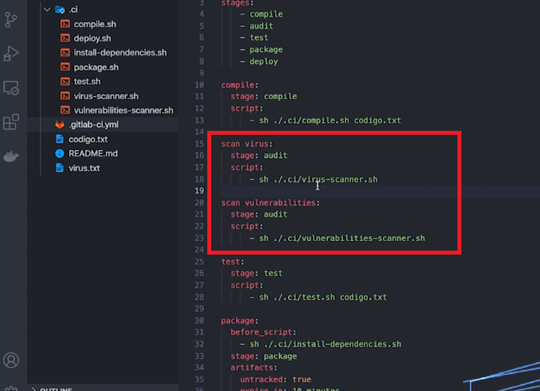

# DevSecOps

- Sec = *Security* = Segurança

- Fluxo do DevOps:
  - **Plan:** Planejamento do que será implementado;
  - **Code:** Implementação do que foi planejado;
  - **Build:** Compilação do código;
  - **Test:** Testes unitários e de integração;
  - **Release:** Criação de Release;
  - **Deploy:** Disponibilização da feature em ambiente produtivo;
  - **Operate e Monitor:** Operar e monitorar a solução entregue.

- Onde segurança entra?

- Quando falamos de DevOps, os três pilares são: Velocidade, entrega rápida e contínua (CI/CD) e confiabilidade.
  - No DevSecOps, há o pilar adicional que é **Segurança a qualquer custo**, isto é, melhor entregar menos com mais segurança, do que mais com segurança nenhuma.

- A ideia é adicionar segurança durante o ciclo de vida do DevOps, de preferência de forma automatizada nos pipelines, afim de atestar que a aplicação segue todas as regras de segurança e *compliance* que a empresa exige.

  

- No exemplo acima, é apresentado apenas um exemplo onde o pipeline possui um estágio de auditoria onde são verificadas paralelamente se o código em questão contém virús, além de realizar testes de vulnerabilidade.
