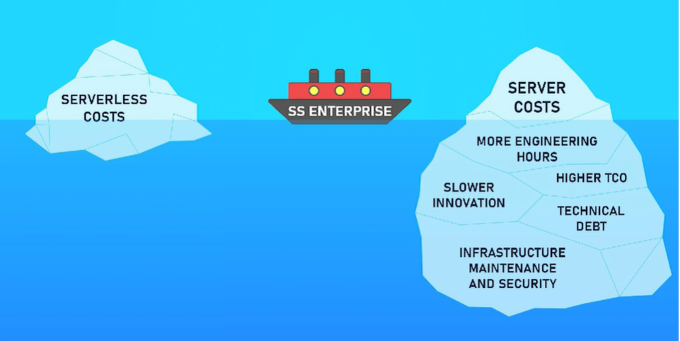

# Serverless

- Quando desejamos disponibilizar nossa aplicação em uma plataforma de Nuvem para que as outras pessoas possam acessá-la, devemos ter conhecimento de diferentes componentes que a compõe (VPCs, Subnets, etc.) e nos preocupar com a configuração e manutenção dessas máquinas, como por exemplo, a atualização dos environments por onde essas aplicações funcionam.

- O Serverless é uma alternativa que procura facilitar o deploy de aplicações em Nuvem, evitando que o cliente tenha que se preocupar com questões de provisionamento, isto é, ele fornece apenas o código que deve ser executado quando requerido e o fornecedor é responsável por configurar a infraestrutura e o ambiente.

- Serverless é um paradigma de executar código sem se preocupar com servidores. Ao contrário do que o nome sugere, os servidores ainda existem!

- Alguns exemplos de fornecedores desse serviço: Amazon Web Services (AWS), Google Cloud e Microsoft Azure.

- Prós:
  - Paga somente pelo tempo de execução do código;
  - Cada função pode ser criada em uma linguagem diferente;
  - Muitos eventos pré-configurados na Cloud ajudam a criar arquiteturas orientadas a eventos;
  - Auto-escalável/Altamente disponível por natureza.

- Contras:
  - Duração execução (Exemplo: AWS permite que uma função seja executada por no máximo 15 minutos ininterruptos);
  - Vendor Lock-In: Migrar de provedor não é uma tarefa transparente, necessita de aprendizado de como aquele funciona;
  - Difícil de debugar: Você não tem como acessar a máquina para verificar logs. Necessário ter uma estratégia para obter logs;
  - É necessária configuração extra para controlar (parcialmente) o ambiente de execução: não é possível controlar a máquina, mas caso seja necessário bibliotecas de terceiros é possível realizar essas configurações.

- Serviços Serveless da AWS:
  - **Lamba:** serviço que permite executar código (paga pelo tempo de execução do código);
  - **API Gateway:** serviço que funciona como roteador de requisições HTTP;
  - **SQS:** serviço de filas;
  - **DynamoDB:** banco de dados não relacional baseado em chave/valor;
  - **SNS:** serviço de Publisher/Subscriber;
  - **S3:** serviço de armazenamento de arquivos (paga pela quantidade de dados armazenados);

- Como podemos visualizar na imagem abaixo, os custos de soluções Serverless estão relacionados apenas a quantidade de uso das mesmas. Já caso de soluções utilizando servidores, além da contratação dos mesmos, há também os custos de horas para deploy, atualização e manutenção desses ambientes, a inovação da aplicação é mais lenta pois se limita as configurações atuais do seu sistema, há um débito técnico, isto é, você deve realizar as atualizações de versões das ferramentas utilizadas para não cair em depreciação e elas pararem de funcionar, além da manutenção da infraestrutura e segurança. Em Serverless, todas essas questões são de responsabilidade do provedor!

  
