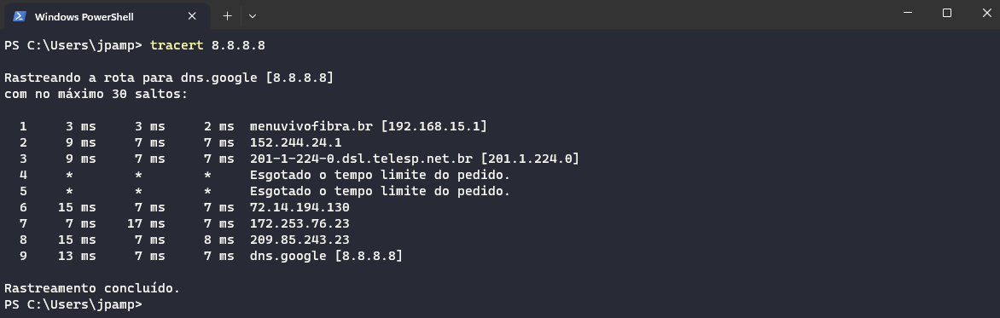

# Redes

## :one: Obtendo informações da rede

- Para obter informações de rede, como IP, máscara de rede e etc., executamos os seguintes comandos:
  - Windows:

    

    - Nesse caso, a máquina estava conectada a Internet utilizando a interface de rede sem fio, portanto, essas informações devem ser consideradas. Caso estivesse conectada utilizando um cabo de rede, deveriamos considerar as informações da interface Ethernet 3.

  - Linux:

    

- Entre as informações disponibilizadas por esses comandos:
  - **Endereço IP:** Identificador único da máquina na rede utilizado para o endereçamento de pacotes;
  - **Interface LOOPBACK:** Interface virtual muito utilizada em situações de desenvolvimento, que permite que um cliente e um servidor, ambos na mesma máquina, consigam se comunicar. É muito comum, ao invés de 127.0.0.1, utilizarmos **localhost**;
  - **MAC Address:** Identificador único da placa de rede que trabalha na camada de enlace de dados nos modelos OSI e TCP/IP. Ele é utilizado para diversas finalidades, como roteamento de pacotes em rede local, filtragem de acesso, autenticação e identificação de dispositivos. É possível, por exemplo, configurar um roteador para permitir que apenas determinados MAC Address consigam se conectar com aquela rede. Ele é composto por seis pares de dígitos hexadecimais separados por hífens ou dois pontos;

- Vale ressaltar que um endereço IP é composto de 32 bits, divididos em 4 grupos de 8 bits cada (octetos). Esse *range* de valores podem variar de 0 à 255.

- A ferramenta [IP Calculator](https://jodies.de/ipcalc) nos traz diversas informações sobre a nossa rede apenas com o fornecimento do IP da nossa máquina e a máscara de rede:

  

  - **Address:** Endereço IP da máquina em questão;
  - **Netmask (ou máscara de rede):** Significa que os primeiros 24 bits (ou 3 octetos) identificam a rede, isto é, todos os dispositivos conectados a essa mesma rede terão o endereço IP com os primeiros 24 bits iguais. A convenção é colocar como o valor 255 os octetos que representam a rede e os demais com 0;
  - **Wildcard:** Essa informação é oposto da *Netmask*, isto é, informa quais octetos identificam a máquina. No exemplo acima, os três primeiros octetos identificam a rede, por isso encontram-se com o valor 0, enquanto o último octeto identifica a máquina, por isso o valor 255;
  - **Network:** Outra nomenclatura utilizada para identificar a rede, onde o valor anterior a barra representa o endereço IP da rede e o valor após a barra representa a máscara de rede;
  - **Broadcast:** O endereço de broadcast é utilizado quando deseja-se enviar mensagens para todos os dispositivos conectados na mesma rede.

- Na imagem acima, outra informação interessante e ainda não mencionada são **HostMin**, **HostMax** e **Hosts/Net**. Essas informações indicam quais possíveis valores mínimo e máximo de endereço IP uma máquina pode assumir, além do número máximo de dispositivos que podem ser conectados a essa rede. Mas então surge o questionamento: se um octeto varia de 0 à 255, para que servem os valores 0 e 255? No caso do endereço 255, já entendemos que ele é utilizado como IP de Broadcast, enquanto o 0 é utilizado para identificar quais octetos não compõe a máscara de rede.
  - O HostMin geralmente é reservado para o **Gateway Padrão** da rede, isto é, o dispositivo responsável por ser a porta de entrada e saída de dados daquela rede local. Comumente em uma rede doméstica, esse Gateway Padrão é o roteador Wi-Fi no qual os dispositivos se conectam para ter acesso a Internet.

## :two: IP Público x IP Privado

- A RFC 1918 define quais os endereços de rede são considerados privados, isto é, não são possíveis de serem acessados de qualquer ponto da Internet, sendo esses:
  - 10.0.0.0/8
  - 172.16.0.0/12
  - 192.168.0.0/16

- Exemplo: Eu estou conectado me minha rede local, no endereço 192.168.15.32 e desejo acessar um servidor localizado na empresa onde eu trabalho, no endereço 172.28.115.2. Se observarmos a imagem abaixo, podemos perceber que esse acesso direto não será possível, pois esse endereço IP encontra-se dentro do *range* de IPs Privados, sendo necessário realizar um acesso remoto utilizando uma VPN, por exemplo, antes de poder acessar esse servidor.

  

  - Agora, se desejarmos acessar um servidor, também da minha empresa, no endereço 172.67.188.168, esse acesso será possível sem a necessidade de uma conexão remota prévia com a rede local, pois ele se encontra fora do *range* de IPs privados, sendo então, um IP Público.

## :three: Resolução de Nomes

- Seja uma situação onde temos uma aplicação que realiza chamadas para outra disponibilizada em um serviço de nuvem, como por exemplo, o AWS. Porém, por algum motivo, essa aplicação é migrada para o Azure, outro provedor de nuvem, que utiliza outro *range* de IPs. Imagine a dor de cabeça se todas as aplicações que utilizam esse sistema precisassem alterar em código o endereço IP que precisa ser chamado.  
  - Graças ao serviço de resolução de domínios/nomes ou DNS (*Domain Name Services*), isso não é necessário;
  - Basta apenas alterar no servidor de DNS o endereço IP ao qual aquele domínio faz referência, que todos os sistemas passarão a ser direcionados para a nova localização;
  - Portanto, uma dica: sempre que possível, utilize o nome do domínio ao invés do endereço IP em código.

- Outra vantagem do serviço de resolução de nomes é que é muito mais fácil para nós seres humanos guardarmos nomes como google.com, do que endereços IPs (se já é difícil em endereços do tipo IPV4, imagina no IPV6, onde são guardados 4 vezes mais bits).

- É possível fazer uma requisição para o servidor de DNS pelo endereço IP de um determinado domínio (o comando é o mesmo para Linux e Windows):

  ```Linux
    nslookup <dominio>
  ```

  - Exemplo:

    

    - A primeira resposta é o endereço IP de um dos servidores do google na versão IPv4 e o segundo é na versão IPv6.  

- É possível obter mais informações:

  ```Linux
    dig @<servidor-dns> <dominio>
  ```

  - Esse comando é muito utilizado para debugar e encontrar possíveis falhas de DNS;
  - Por padrão, o IP retornado vem no formato IPv4. Para visualizar o IPv6, basta inserir o parâmetro `AAAA`;
  - Exemplo:

    

    - Na primeira linha do `ANSWER SECTION`, é retornado a resolução do domínio passado como parâmetro;
    - `Query time` retorna o tempo de resposta para aquela requisição;
    - `SERVER` retorna qual servidor de DNS retornou aquela resposta (no caso, como não foi passado nenhum servidor DNS como parâmetro, foi consultado o padrão configurado na máquina que é um servidor local);
    - `WHEN` retorna quando foi realizada a requisição;
    - `MSG SIZE rcvd` retorna o tamanho da mensagem de resposta.

  - Exemplo especificando um servidor de DNS:

    

- Para verificar quais os servidores DNS configurados na máquina:
  - Windows:

    ```Windows
      ipconfig /all
    ```

    - Exemplo:

      

      - No exemplo acima, o servidor de DNS padrão configurado é o Gateway Padrão da minha rede doméstica, onde provavelmente há informações de qual servidor DNS consultar.

  - Linux:

    ```Bash
      cat /etc/resolv.conf
    ```

    - Exemplo:

      

      - No exemplo acima, é configurado um servidor DNS local para resolução de nomes.

- Nos sistema operacionais Linux, há um arquivo em `/etc/hosts` onde é possível configurar resoluções de nomes para endereços IPs. Deve-se ter em mente que este arquivo não funciona com substituto do servidor DNS e deve ser utilizado apenas para testes.

  

  - Por isso, ao digitarmos `localhost`, logo nossa máquina entende que desejamos nos conectar com a interface de LOOPBACK da nossa máquina:

    

## :four: Diagnóstico de Rede

### :arrow_right: PING

- É uma prática muito comum utilizarmos o comando `ping` quando desejamos verificar se um determinado destino está operacional. Porém, essa é uma prática equivocada, uma vez que se os pacotes enviados não estão sendo retornados, isso não significa necessariamente que o destino em questão está fora de serviço.

- O PING utiliza o protocolo ICMP para enviar pacotes para um determinado destino e como resposta recebe outro informando que a entrega foi bem sucedida. O nome é uma analogia ao jogo de Ping Pong, onde cliente e servidor trocar pacotes da mesma forma que jogadores rebatem a bolinha de um lado para o outro.

- Porém, determinados servidores podem implementar em suas regras de Firewall para que esse protocolo não esteja disponível para comunicação. Portanto, se o pacote enviado sofre *timeout*, isso não significa necessariamente que o destino em questão encontra-se com falha. Pode significar apenas que àquele servidor em específico não aceita comunicações utilizando esse protocolo.

- Seu uso é indicado para verificar questões de latência (tempo entre o envio do pacote e o recebimento da resposta).


- No primeiro exemplo acima, é realizado um PING para um dos servidores DNS da Google e podemos perceber a entrega e a resposta foram bem sucedidas. Na segunda imagem, é realizado o mesmo comando, dessa vez para o site do Governo Federal e podemos perceber que as requisições sofreram *timeout*, porém, se tentamos acessar site via Browser, o mesmo abre normalmente, o que nos leva a entender que o servidor apenas não permite comunicações utilizando o protocolo ICMP.
  - O parâmetro `-n` indica o número de pacotes que desejamos enviar;
  - Para conhecer os outros parâmetros existentes, utilizar o `--help`.

- O comando é o mesmo para Windows e Linux.

### :arrow_right: TRACEROUTE/TRACERT

- Esse comando é utilizado para visualizar a rota realizada por um pacote a partir de uma origem (por padrão, a máquina onde o mesmo está sendo executado) até um determinado destino.

- Nos Sistemas Operacionais baseados em UNIX, o comando é o `traceroute`. Já no caso do Windows, o comando é o `tracert`.



- Por padrão, são realizados no máximo trinta saltos para se alcançar o endereço de destino e em cada um deles são enviados três pacotes.

- Os valores numéricos retornados são os tempos, em milissegundos, entre envio e recebimento da resposta. O nome, mais a direita, é o endereço IP ou hostname da máquina pelo qual o pacote passou para atingir o destino.
  - Quando um pacote retorna `*` significa que o mesmo se perdeu na rede;

- Podemos perceber que o hostname da máquina do primeiro salto é `menuvivofibra.br [192.168.15.1]`. Essa máquina nada mais é do que o Gateway Padrão da minha rede doméstica, que é um ponto de acesso fornecido pelo meu provedor de serviço de Internet. Sempre que desejarmos acessar um endereço fora da rede local, ele sempre será o primeiro salto. Caso eu tente realizar o comando para atingir um equipamento dentro da minha própria rede, os pacotes não passarão por ele.

- É possível utilizar um parâmetro para definir qual o protocolo utilizado para o envio dos pacotes: ICMP, TCP, UDP, etc. Por padrão, é utilizado o UDP.

- Se jogarmos o resultado do comando no [Visual Traceroute](https://whatismyip.com.br/visualtraceroute.php), é possível ver o caminho pelo qual o pacote passou pelo Google Maps.

## :five: Portas

- Quando enviamos um pacote para um determinado servidor, é necessário informar a porta para o qual o mesmo deve ser enviado, indicando o serviço para o qual aquele dado deve ser enviado.

- Analogia: quando enviamos uma carta pelo correio, inserimos no campo de destinatário o endereço, isto é, logradouro e número, para o qual desejamos enviar aquela correspondência. Se o destinatário for um prédio, é necessário informar também o número para o qual a carta deve ser enviada, caso contrário, ela chegaria na portaria e porteiro não saberia para onde encaminhá-la.
  - Nesse exemplo, a carta seria o pacote, o prédio seria o servidor e o apartamento seria a porta.

- O arquivo `/etc/services` as portas que estão reservadas para determinados serviços.
  
- As primeiras 1024 portas são reservadas para processos específicos.
  - Exemplos:

    | Porta | Serviço                      |
    | :---: | :--------------------------: |
    | 20    | FTP (Transferência de dados) |
    | 21    | FTP (Autenticação)           |
    | 22    | SSH                          |
    | 23    | Telnet                       |
    | 80    | HTTP                         |
    | 443   | HTTPS                        |

- O Telnet é um protocolo para realizar acesso remoto. Porém, ele não é recomendado nos dias de hoje por não possuir criptografia, sendo substituído pelo SSH. Porém, ele é uma alternativa para se realizar diagnóstico de rede.
  - Foi explicado anteriormente que o insucesso da execução do comando PING não significa que o destino em questão encontra-se indisponível, podendo ser apenas uma restrição criada por regra de firewall para impedir interações utilizando o protocolo ICMP. Uma alternativa é utilizar o Telnet:

  ```Bash
    telnet www.gov.br 80
  ```

  - Se tentarmos acessar a porta 23 (padrão Telnet), a ação não será bem sucedidade. Porém, se tentarmos conectar na porta 80, vamos receber um sinal positivo sobre a tentativa de conexão.

- Outra alternativa é utilizar o `curl`. Ele é uma ferramenta que permite realizar requisições HTTP através da linha de comando.

## :six: NAT (Network Address Translation)

- Após todos os conteúdos apresentados, talvez um questionamento apareça: se os endereços IPs que utilizamos em redes internas, sejam elas domésticas ou corporativas, não são visíveis e muito menos roteáveis para o resto da Internet, como um serviço responde por uma requisição, se o endereço do remetente não é roteável?

- No início dos anos 90 já existiam estudos que mostravam que em poucos anos os endereços IP válidos se esgotariam, sendo necessário aumentar a gama de valores afim de suportar mais máquinas. Foi proposto então a mudança do IPv4 para o IPv6, aumentando de 32 para 128 bits o tamanho desses endereços, permitindo assim que muitas mais máquinas se conectassem a rede. Como essa mudança afetaria consideravelmente a disponibilidade da rede, ela precisou ser feita de forma gradual e para permitir que novos dispositivos se conectassem a rede enquanto a alteração fosse acontecendo, algumas técnicas foram criadas, aumentando o tempo de vida do IPv4. Entre as propostas está o *Network Address Translation* (NAT), em português, Tradução de Endereços de Rede.

- Quando você assina um serviço para fornecimento de Internet, comumente esse serviço chega através de cabos coaxiais ou fibra ótica, que são ligados a um Modem/Roteador, muitas vezes oferecido pela própria provedora. Quando esse dispositivo é conectado, automaticamente ele recebe um endereço IP válido, também conhecido como IP Público. Esse endereço é acessável a partir de qualquer ponto da Internet e expõe sua rede local para o mundo.

- Na mesma rede, mas internamente, quando um dispositivo se conecta a ela, seja via Wi-Fi ou a cabo, ele recebe um endereço IP dentro do range especificado para redes locais, não sendo possível acessá-lo de fora dessa rede. A esse tipo de endereço, damos o nome de IP Privado.
  - O fornecimento do endereço IP é feito por um protocolo chamado DHCP (*Dynamic Host Configuration Protocol*), que vem instalando no seu roteador.

- Quando realizamos uma requisição HTTP, por exemplo, para acessar uma determinada página Web, no que esse pacote sai da nossa máquina, o endereço de origem informado no pacote é o IP Privado da nossa máquina. Quando esses pacotes chegam ao Gateway Padrão (geralmente o roteador doméstico), antes de sair para a Internet, um processo interno altera o endereço de origem para o IP Público. Assim, quando o destino precisar devolver uma resposta para a requisição, ele saberá para onde deve enviá-la, pois o endereço de origem informado é roteável. Esse processo que altera entre IP Privado e Público é feito pelo NAT.

- Existe um comando que nos permite verificar o IP Público da nossa rede:

  ```Bash
    curl ifconfig.me
  ```
