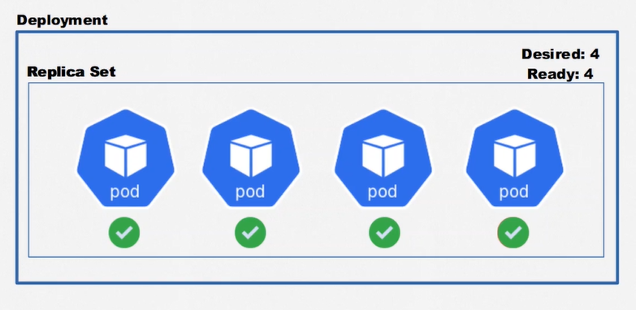

# Kubernetes - Deployments, Volumes e Escalabilidade

## :one: ReplicaSets

- Desejamos que nossos sistemas possuam alta disponibilidade, porém, pode acontecer a qualquer momento de algum Pod que compõe uma determinada solução cair, causando problemas. É desejável que ao identificar a inoperabilidade de um Pod, que o mesmo seja reiniciado para estabilizar o sistema. Para isso utilizaremos o recurso **ReplicaSets**.

- Além de fazer essa reestabilização automática, desejamos que determinados Pods possuam réplicas para suportar a alta carga de trabalho e também para que o serviço não fique indisponível a nenhum momento, por conta de sua criticidade para o funcionamento do sistema.


- Para descrever um ReplicaSet:

  ```YAML
    apiVersion: apps/v1
    kind: ReplicaSet
    metadata:
      name: portal-noticias-replicaset
    spec:
      template:
        metadata:
          name: portal-noticias
          labels:
            app: portal-noticias
        spec:
          containers:
            - name: portal-noticias-container
              image: aluracursos/portal-noticias:1
              ports:
                - containerPort: 80
              envFrom:
                - configMapRef:
                    name: portal-configmap
      replicas: 3
      selector:
        matchLabels:
          app: portal-noticias
  ```

  - A `apiVersion` nesse caso será um pouco diferente se comparado aos recursos que vimos até o momento;
  - Precisamos definir um `template` do Pod que desejamos que o ReplicaSet atue. Devemos definir todos os valores exatamente como definimos um arquivo de Pods;
  - Um mesmo ReplicaSet pode encapsular uma ou mais `replicas` de um Pod. Caso um deles fique indisponível, seja lá qual for o motivo, os demais irão suprir a sua ausência, enquanto o recurso ficará responsável por restabelecê-lo;
  - Apesar de definir um template explicitamente dentro do arquivo do ReplicaSet, é necessário utilizar um `selector` para indicar qual o Pod que desejamos que o ReplicaSet fique responsável.

- Na imagem abaixo podemos visualizar um exemplo prático de como os ReplicaSets funcionam. No terminal á esquerda é executado um comando para ficar monitorando os ReplicaSets existentes no Cluster, enquanto no terminal à direita os Pods do Cluster são listados e um daqueles que compõe o ReplicaSet é selecionado e deletado. Nesse momento, podemos visualizar no terminal à esquerda que há uma atualização sobre o estado do ReplicaSet, que fica com dois Pods por alguns segundos e rapidamente recria aquele deletado.

  

  - Outra coisa que podemos perceber é que os Pods de um mesmo ReplicaSet possuem o mesmo nome, diferenciando-se pela string no final. Após deletar um dos Pods e listá-los novamente após a recriação, vemos que o nome de um deles muda, o que comprova que quando um Pod cai ou é removido, o ReplicaSet cria um novo.

- Não é necessário fazer nenhuma alteração no Service que expõe esses Pods, uma vez que a associação entre eles é feita através de `labels` e todos eles possuem o mesmo. O Service ficará responsável por realizar o balanceamento de carga entre as instâncias do ReplicaSet.

- Os comandos para criar, listar, editar e remover um ReplicaSet são os mesmos utilizados pelos recursos anteriores.

## :two: Deployments

- Um Deployment nada mais é do que uma camada que envelopa um ReplicaSet e adiciona funcionalidade de versionamento àquele recurso. Como boa prática costuma-se utilizar Deployments ao invés de criar direto os ReplicaSets.



- O arquivo de Deployment é similar ao do ReplicaSet:

  ```YAML
    apiVersion: apps/v1
    kind: Deployment
    metadata:
      name: nginx-deployment
    spec:
      replicas: 3
      template:
        metadata:
          name: nginx-pod
          labels:
            app: nginx-pod
        spec:
          containers:
            - name: nginx-container
              image: nginx:stable
              ports:
                - containerPort: 80
      selector:
        matchLabels:
          app: nginx-pod
  ```

- Para visualizar o histórico de versões de um Deployment (Similar ao `git log`):

  ```Windows
    kubectl rollout history deployment <nome-deployment>
  ```

- Caso atualizemos um Deployment e desejamos aplicar a nova versão (Similar ao `git commit`):

  ```Windows
    kubectl apply -f <caminho-arquivo> --record
  ```

- Para adicionar uma mensagem àquela versão (Similar a escrever uma mensagem para descrever as alterações realizadas naquele commit):

  ```Windows
    kubectl annotate deployment <nome-deployment> kubernetes.io/change-cause="<mensagem>"
  ```

- Para voltar para uma versão anterior (Similar ao `git restore`):

  ```Windows
    kubectl rollout undo deployment <nome-deployment> --to-revision=<numero-revision>
  ```

  - O número da revision pode ser obtido no comando de visualizar o histórico de versões.

- Esse é o resultado de se utilizar Deployments no projeto:

  

- Os comandos para criar, listar, editar e remover um Deployment são os mesmos utilizados pelos recursos anteriores.
