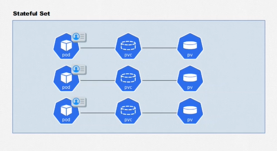

# Kubernetes - Deployments, Volumes e Escalabilidade

## :one: ReplicaSets

- Desejamos que nossos sistemas possuam alta disponibilidade, porém, pode acontecer a qualquer momento de algum Pod que compõe uma determinada solução cair, causando problemas. É desejável que ao identificar a inoperabilidade de um Pod, que o mesmo seja reiniciado para estabilizar o sistema. Para isso utilizaremos o recurso **ReplicaSets**.

- Além de fazer essa reestabilização automática, desejamos que determinados Pods possuam réplicas para suportar a alta carga de trabalho e também para que o serviço não fique indisponível a nenhum momento, por conta de sua criticidade para o funcionamento do sistema.


- Para descrever um ReplicaSet:

  ```YAML
    apiVersion: apps/v1
    kind: ReplicaSet
    metadata:
      name: portal-noticias-replicaset
    spec:
      template:
        metadata:
          name: portal-noticias
          labels:
            app: portal-noticias
        spec:
          containers:
            - name: portal-noticias-container
              image: aluracursos/portal-noticias:1
              ports:
                - containerPort: 80
              envFrom:
                - configMapRef:
                    name: portal-configmap
      replicas: 3
      selector:
        matchLabels:
          app: portal-noticias
  ```

  - A `apiVersion` nesse caso será um pouco diferente se comparado aos recursos que vimos até o momento;
  - Precisamos definir um `template` do Pod que desejamos que o ReplicaSet atue. Devemos definir todos os valores exatamente como definimos um arquivo de Pods;
  - Um mesmo ReplicaSet pode encapsular uma ou mais `replicas` de um Pod. Caso um deles fique indisponível, seja lá qual for o motivo, os demais irão suprir a sua ausência, enquanto o recurso ficará responsável por restabelecê-lo;
  - Apesar de definir um template explicitamente dentro do arquivo do ReplicaSet, é necessário utilizar um `selector` para indicar qual o Pod que desejamos que o ReplicaSet fique responsável.

- Na imagem abaixo podemos visualizar um exemplo prático de como os ReplicaSets funcionam. No terminal á esquerda é executado um comando para ficar monitorando os ReplicaSets existentes no Cluster, enquanto no terminal à direita os Pods do Cluster são listados e um daqueles que compõe o ReplicaSet é selecionado e deletado. Nesse momento, podemos visualizar no terminal à esquerda que há uma atualização sobre o estado do ReplicaSet, que fica com dois Pods por alguns segundos e rapidamente recria aquele deletado.

  

  - Outra coisa que podemos perceber é que os Pods de um mesmo ReplicaSet possuem o mesmo nome, diferenciando-se pela string no final. Após deletar um dos Pods e listá-los novamente após a recriação, vemos que o nome de um deles muda, o que comprova que quando um Pod cai ou é removido, o ReplicaSet cria um novo.

- Não é necessário fazer nenhuma alteração no Service que expõe esses Pods, uma vez que a associação entre eles é feita através de `labels` e todos eles possuem o mesmo. O Service ficará responsável por realizar o balanceamento de carga entre as instâncias do ReplicaSet.

- Os comandos para criar, listar, editar e remover um ReplicaSet são os mesmos utilizados pelos recursos anteriores.

## :two: Deployments

- Um Deployment nada mais é do que uma camada que envelopa um ReplicaSet e adiciona funcionalidade de versionamento àquele recurso. Como boa prática costuma-se utilizar Deployments ao invés de criar direto os ReplicaSets.


- O arquivo de Deployment é similar ao do ReplicaSet:

  ```YAML
    apiVersion: apps/v1
    kind: Deployment
    metadata:
      name: nginx-deployment
    spec:
      replicas: 3
      template:
        metadata:
          name: nginx-pod
          labels:
            app: nginx-pod
        spec:
          containers:
            - name: nginx-container
              image: nginx:stable
              ports:
                - containerPort: 80
      selector:
        matchLabels:
          app: nginx-pod
  ```

- Para visualizar o histórico de versões de um Deployment (Similar ao `git log`):

  ```Windows
    kubectl rollout history deployment <nome-deployment>
  ```

- Caso atualizemos um Deployment e desejamos aplicar a nova versão (Similar ao `git commit`):

  ```Windows
    kubectl apply -f <caminho-arquivo> --record
  ```

- Para adicionar uma mensagem àquela versão (Similar a escrever uma mensagem para descrever as alterações realizadas naquele commit):

  ```Windows
    kubectl annotate deployment <nome-deployment> kubernetes.io/change-cause="<mensagem>"
  ```

- Para voltar para uma versão anterior (Similar ao `git restore`):

  ```Windows
    kubectl rollout undo deployment <nome-deployment> --to-revision=<numero-revision>
  ```

  - O número da revision pode ser obtido no comando de visualizar o histórico de versões.

- Esse é o resultado de se utilizar Deployments no projeto:

  

- Os comandos para criar, listar, editar e remover um Deployment são os mesmos utilizados pelos recursos anteriores.

## :three: Persistência de Dados

- Estamos tendo um problema com o projeto que ao reiniciar um Pod, todo seu conteúdo, no caso, as notícias criadas através do Sistema de Notícias, são perdidas. Para não perder esses dados, precisamos persistí-los de alguma forma, e o Kubernetes já possui recursos para nos ajudar nessa questão.

### :arrow_right: Volumes

- Os **Volumes** são similares aos existentes em Docker, onde mapeamos um ponto entre o sistema de arquivos do container e da máquina host para realizar o compartilhamento de dados.


- Os Volumes são independentes do ciclo de vida dos containers, isto é, caso um container caia, o Volume permanecerá existindo. Porém, se o Pod, seja por la qual motivo, cair, os Volumes relacionados serão removidos, pois nesse caso há uma relação de dependência.

- Existem diferentes tipos de Volumes, mas vamos tratar aqui do Volume já conhecido por quem já estudou Docker que são os Volumes baseados em caminhos no Sistema de Arquivos, chamado de `hostPath`. Nesse tipo de Volume, especificamos um caminho dentro da máquina host e outro dentro do container e tudo o que for criado em um, será replicado no outro.

- No exemplo do `hostPath`, após a remoção dos volumes, os arquivos criado nesse ponto mapeado permanecerão existindo na máquina host. Caso o volume seja criado novamente, os arquivos ainda existirão.

- Para criar um Volume:

  ```YAML
    apiVersion: v1
    kind: Pod
    metadata:
      name: pod-volume
    spec:
      containers:
        - name: nginx-container
          image: nginx:latest
          volumeMounts:
            - mountPath: /volume-dentro-do-container
              name: primeiro-volume
        - name: jenkins-container
          image: jenkins/jenkins
          volumeMounts:
            - mountPath: /volume-dentro-do-container
              name: primeiro-volume
      volumes:
        - name: primeiro-volume
          hostPath:
            path: /run/desktop/mnt/host/c/Users/jpamp/OneDrive/Área de Trabalho/primeiro-volume
            type: Directory
  ```

  - O Volume é criado diretamente dentro do arquivo de configuração do Pod, mas o procedimento seria o mesmo se criado em um ReplicaSet ou Deployment;
  - Como explicado anteriormente, o Volume está relacionado ao ciclo de via do Pod, isto é, se ele cai, o Volume é removido. Portanto, quando vamos declarar o Volume, devemos colocá-lo nas especificações do Pod e não do container, por isso `volumes` e `containers` ficam no mesmo nível hierarquico do arquivo;
  - O tipo `hostPath` é utilizado para mapear um ponto do sistema de arquivo da máquina host, especificado em `path`, enquanto `type` indica o que está sendo mapeado: um arquivo, um diretório, etc;
  - Nas especificações do container, é necessário determinar, em `mountPath`, em qual ponto do seu sistema de arquivos será realizado o mapeamento do volume. Em `name` deve-se indicar qual o volume que será mapeado;
  - Como podemos perceber, o Pod da configuração acima possui dois containers, um para o Nginx e outro para o Jenkins. Para delimitar o fim das configurações de um container e início do outro, é utilizado o hífen, seguido do atributo `name`.

- Caso o `type` for um diretório, porém, o mesmo não existir no sistema de arquivos, um problema ocorrerá e o Pod não será criado. Porém, podemos utilizar o tipo `DirectoryOrCreate` para dizer ao Kubernetes para ele criar o diretório caso ele não o encontre no caminho passado.

- É necessário entender que para os Pods, a máquina host no caso é o Cluster, onde de fato eles são armazenados. Portanto, os caminhos absolutos passados em `path` não podem iniciar do diretório raiz do Sistema de Arquivos da máquina usuária. No caso do Windows, o Cluster virtualizado é criado automaticamente quando o Kubernetes é habilitado através do Docker Desktop. No Linux, o Cluster virtualizado é criado utilizando o Minikube.
  - No Windows, o caminho em `path` deve sempre começar com `/run/desktop/mnt/host/c`, sendo `c` a pasta `C:`. Esse é o caminho a partir do diretório raiz do sistema de arquivos do Cluster virtualizado até o diretório raiz do sistema de arquivos da máquina host.
  - No caso do Linux, é necessário acessar o Minikube utilizando o comando `minikube ssh` e criar dentro da máquina virtual os arquivos e diretórios que devem ser mapeados.

### :arrow_right: PersistentVolumes

- Os **PersistentVolumes** são uma alternativa onde o Volume não possui dependencia do ciclo de vida de um Pod, isto é, caso o Pod seja removido, seja por lá qual motivo, o volume seguirá existindo.


- O PersistentVolume funciona como uma API que irá abstrair a forma como os dados são armazenados e acessados.

- Para um Pod acessar um PersistentVolume (PV), ele utiliza uma camada intermediária chamada PersistenVolumeClaim (PVC).

- Para criar um PersistentVolume:

  ```YAML
    apiVersion: v1
    kind: PersistentVolume
    metadata:
      name: pv-1
    spec:
      capacity:
        storage: 10Gi
      accessModes:
        - ReadWriteOnce
        # - ReadWriteMany
        # - ReadOnlyMany
      gcePersistentDisk:
        pdName: pv-disk
      storageClassName: standard
  ```

  - É necessário informar a capacidade de armazenamento do volume em `capacity`, sendo no exemplo acima 10 Gigabytes;
  - É preciso também definir o formato de acesso em `accessModes`, se é apenas leitura, leitura e escrita e se os dados podem ser manipulados um usuário por vez ou vários ao mesmo tempo.

- Para criar um PersistentVolumeClaim:

  ```YAML
  apiVersion: v1
  kind: PersistentVolumeClaim
  metadata:
    name: pvc-1
  spec:
    accessModes:
      - ReadWriteOnce
    resources:
      requests:
        storage: 10Gi
    storageClassName: standard
  ```

  - O Kubernetes irá associar o PV e o PVC através de suas configurações, ou seja, ambos os recursos devem possuir os mesmos `accessMode`, `storage`, etc.

- Como deve ser configurado o Pod:

  ```YAML
    apiVersion: v1
    kind: Pod
    metadata:
      name: pod-pv
    spec:
      containers:
        - name: nginx-container
          image: nginx:latest
          volumeMounts:
            - mountPath: /volume-dentro-do-container
              name: primeiro-pv
      volumes:
        - name: primeiro-pv
          persistentVolumeClaim:
            claimName: pvc-1
  ```

  - A criação do volume dentro do container é igual a vista no tópico anterior. A diferença vai ser nas especificações do volume, onde será utilizada o tipo `persistentVolumeClaim`, ao invés de `hostPath`, e será passado em `claimName` o mesmo nome definido nos metadados do arquivo de configuração do PVC.

### :arrow_right: StorageClasses

- Para apresentar o conceito de PersistentVolume no tópico anterior, o instrutor exemplificou utilizando o Kubernetes Plataform no Google Cloud. Para isso, ele precisou criar manualmente um disco para armazenar os dados do volume, além de criar manualmente o PersistentVolume. Os **StoragesClasses** permitem automatizar esse processo de criação tanto do disco quanto do PersistentVolume, basta criar um PersistentVolumeClaim e associá-lo a um StorageClass.


- Para criar o StorageClass:

  ```YAML
    apiVersion: storage.k8s.io/v1
    kind: StorageClasses
    metadata:
      name: slow
    provisioner: kubernetes.io/gce-pd
    parameters:
      type: pd-standard
      fstype: ext4
  ```

  - É necessário informar em `provisioner`, a plataforma que irá provisionar a criação do disco para armazenar o volume (Nesse exemplo, será o Google Computing Engine), o tipo do disco em `type` (Para disco rígido será `pd-standard` - valor padrão - e SSD `pd-ssd`) e o sistema de arquivos suportado em `fstype`.

- Para criar o PersistentVolumeClaim:

  ```YAML
    apiVersion: v1
    kind: PersistentVolumeClaim
    metadata:
      name: pvc-2
    spec:
      accessModes:
        - ReadWriteOnce
      resources:
        requests:
          storage: 10Gi
      storageClassName: slow
  ```

  - Para associar o PVC ao StorageClass, o valor de `storageClassName` deve ser o mesmo de `name` nos metadados do arquivo de configuração do StorageClass;
  - As configurações de `accessModes` e `storage` serão replicadas para o PersistentVolume.

- Após criar esses recursos, automaticamente um disco e o PersistentVolume serão criados.

- As configurações do Pod serão identicas as vistas no tópico anterior:

  ```YAML
    apiVersion: v1
    kind: Pod
    metadata:
      name: pod-sc
    spec:
      containers:
        - name: nginx-container
          image: nginx:latest
          volumeMounts:
            - mountPath: /volume-dentro-do-container
              name: primeiro-pv
      volumes:
        - name: primeiro-pv
          persistentVolumeClaim:
            claimName: pvc-2
  ```

- Caso os StorageClasses forem utilizados localmente, não há o provisionamento de memória dinamicamente, porém, pode ser utilizado para retardar a criação do PersistentVolume até que um Pod seja instanciado (isso é definido pelo `volumeBindingMode` igual a `WaitForFirstConsumer`):

  ```YAML
    apiVersion: storage.k8s.io/v1
    kind: StorageClass
    metadata:
      name: local-storage
    provisioner: kubernetes.io/no-provisioner
    volumeBindingMode: WaitForFirstConsumer
  ```

- O Kubernetes possui um StorageClass `default` que define as características do disco que deve ser criado caso o `StorageClasseName` não seja determinado.

### :arrow_right: StatefulSets

- Um **StatefulSet** funciona similar a um Deployment, porém, é utilizado em casos onde os Pods precisam de persistência de dados.



- Ao definir um Pod é necessário definir também um PersistentVolumeClaim.

- Os Pods são criados junto de um identificador único. Caso por algum motivo o Pod venha a cair, o mesmo será recriado com o mesmo ID assim continuando vinculado ao mesmo PersistentVolume.

- Para configurar um StatefulSet:

  ```YAML
    apiVersion: apps/v1
    kind: StatefulSet
    metadata:
      name: sistema-noticias-statefulset
    spec:
      replicas: 1
      template:
        metadata:
          labels:
            app: sistema-noticias
          name: sistema-noticias
        spec:
          containers:
            - name: sistema-noticias-container
              image: aluracursos/sistema-noticias:1
              ports:
                - containerPort: 80
              envFrom:
                - configMapRef:
                    name: sistema-configmap
              volumeMounts:
                - name: imagens
                  mountPath: /var/www/html/uploads
                - name: sessao
                  mountPath: /tmp
          volumes:
            - name: imagens
              persistentVolumeClaim:
                claimName: imagens-pvc
            - name: sessao
              persistentVolumeClaim:
                claimName: sessao-pvc
      selector:
        matchLabels:
          app: sistema-noticias
      serviceName: svc-sistema-noticias
  ```

  - Assim como um Deployment, é necessário definir o número de `replicas` do Pod que é configurado em `template`. A grande diferença para o Deployment é que é necessário criar os `volumes` nas especificações do Pod;
  - É necessário também informar o `serviceName` que liberará o acesso aos containers desse Pod;
  - Para criar o StatefulSet, o PersistentVolumeClaim já deve estar criado.

- No arquivo de PersistentVolumeClaim responsável pelo acesso aos Volumes de `imagens` e `sessao`, nenhum StorageClass é definido, assim, o StorageClass padrão do Cluster é utilizado e o PersistentVolume criado automaticamente.

## :four: Probes

- Caso um Pod caia, podemos utilizar ReplicaSets, Deployments ou StatefulSets para identificar a instabilidade e reiniciá-lo. Porém, podem acontecer casos onde o Pod está com falhas que não causam sua queda, como por exemplo, retornando HTTP Error 500 em diversas requisições de uma API, sendo esses erros indetectáveis por parte desses recursos. Para tornar essas falhas visíveis, permitindo que o Pod seja reiniciado caso elas ocorram, podemos utilizar **Probes**.

- As Probes podem realizar verificações de três formas:
  - **Requisições HTTP GET** em um caminho e porta especificados no arquivo de configuração. Caso a resposta seja maior ou igual a 200 e menor do que 400, entende-se que o container está funcionando corretamente;
  - **Estabelecimento de conexão TCP** em porta especificada no arquivo de configuração. Caso a conexão seja estabelecida, entende-se que o container está funcionando corretamente;
  - **Executando comandos** como leitura de arquivos, execução de scripts, etc. Caso nenhum erro seja retornado na execução do comando, entende-se que o container está funcionando corretamente.

### :arrow_right: Readiness Probe

- Quando criamos um Pod, ele será de fato disponibilizado quando todos seus containers estiverem criados, ficando no estado de *Running*. Porém, pode ser que determinados containers demorem mais do que outros para ficarem pronto, fazendo com que o Pod seja disponibilizado antes mesmo da aplicação estar funcionando por completo. Podemos utilizar **Readiness Probes** para indicar para o Pod quando de fato o container foi criado e inicializado com sucesso.

- Como configurar um Readiness Probe no seu Pod:

  ```YAML
  apiVersion: apps/v1
  kind: StatefulSet
  metadata:
    name: sistema-noticias-statefulset
  spec:
    replicas: 1
    template:
      metadata:
        labels:
          app: sistema-noticias
        name: sistema-noticias
      spec:
        containers:
          - name: sistema-noticias-container
            image: aluracursos/sistema-noticias:1
            ports:
              - containerPort: 80
            envFrom:
              - configMapRef:
                  name: sistema-configmap
            volumeMounts:
              - name: imagens
                mountPath: /var/www/html/uploads
              - name: sessao
                mountPath: /tmp
            readinessProbe:
                httpGet:
                  path: /inserir_noticias.php
                  port: 80
                periodSeconds: 10
                failureThreshold: 5
                initialDelaySeconds: 3
        volumes:
          - name: imagens
            persistentVolumeClaim:
              claimName: imagens-pvc
          - name: sessao
            persistentVolumeClaim:
              claimName: sessao-pvc
    selector:
      matchLabels:
        app: sistema-noticias
    serviceName: svc-sistema-noticias
  ```

  - No exemplo acima foi configurado um Readness Probe que indica que deve ser verificada a porta `80` na rota `/inserir_noticias.php` e caso essa requisição possua um status de sucesso (maior ou igual a 200 e menor do que 400), é indicado para o Pod que o container foi inicializado com sucesso.
  - Podemos utilizar parâmetros para alterar o comportamente da Probe:

    - `periodSeconds`: Define um intervalo, em segundos, de quanto em quanto tempo a verificação deve ser realizada;
    - `failureThreshold`: Define um limiar de erros, isto é, caso sejam realizada X tentativas de conexão mal sucedidas, deve-se indicar que o container não foi inicializado com sucesso (Existe também o `successThreshold`, que tem a lógica inversa, onde podemos determinar quantas vezes uma requisição precisa ser bem sucedida para entendermos que o container está funcionando corretamente);
    - `initialDelaySeconds`: Define um delay para o início das verificações.

- Um contexto onde o uso de Readiness Probe se faz importante é quando desejamos realizar a troca de versão de Deployments, mas não desejamos que nossa aplicação fique um momento sequer fora do ar. Quando atualizamos um Pod, o Kubernetes só remove a versão antiga quando ele entende que a versão nova já está operacional. Se utilizarmos uma Readiness Probe, podemos indicar com precisão para o Kubernetes quando o Pod de fato está pronto e a versão antiga pode ser removida, evitando indisponibilidades.

### :arrow_right: Liveness Probe

- As **Liveness Probes** funcionam como *healtcheck*, isto é, verificam se o container está funcionando corretamente. Um exemplo é possuirmos um endpoint em nossa API chamado `SelfMonitoring` e pedirmos para nossa Probe enviar requisições HTTP do tipo GET, de tempos em tempos para ele, e caso um status fora da faixa maior ou igual a 200 e menor que 400 seja retornado, indica que a API está com problemas e que o container deve ser reiniciado imediatamente.

- Para configurar um Liveness Probe no seu Pod:

  ```YAML
    apiVersion: apps/v1
    kind: Deployment
    metadata:
      name: portal-noticias-deployment
    spec:
      template:
        metadata:
          name: portal-noticias
          labels:
            app: portal-noticias
        spec:
          containers:
            - name: portal-noticias-container
              image: aluracursos/portal-noticias:1
              ports:
                - containerPort: 80
              envFrom:
                - configMapRef:
                    name: portal-configmap
              livenessProbe:
                httpGet:
                  path: /
                  port: 80
                periodSeconds: 10
                failureThreshold: 3
                initialDelaySeconds: 20
      replicas: 3
      selector:
        matchLabels:
          app: portal-noticias
  ```

  - O exemplo é semelhante ao visto no tópico anterior de Readiness Probe. A diferença é que no caso anterior, a verificação era feita para determinar se o container já estava disponível, enquanto nesse caso é para verificar se ele está ativo.

### :arrow_right: Exemplo 1

- [Vídeo no Youtube](https://www.youtube.com/watch?v=WzQbGuVNr7c)

- O vídeo acima apresenta uma explicação sobre as Probes Readiness e Liveness através de um exemplo onde é criada uma API utilizando Node.JS.

- Para explicar o conceito da Readiness Probe, o instrutor adicionou um delay de 10 segundos utilizando `setTimeout` antes da API começar a escutar na porta 3000 e mostrou que mesmo com a API ainda não escutando requisições, que o Pod, quando criado, já recebia status de Running e era possível realizar requisições para aquele endpoint. Para solucionar esse problema, ele adicionou uam Readiness Probe dizendo que era para o Pod entender que a API estava operacional apenas quando uma requisição do HTTP tipo GET na porta 3000 obter sucesso, isto é, retornando um status maior ou igual a 200 e menor do que 400. A partir de então o Pod começou a ir para status de Running apenas quando de fato a API estava escutando na porta esperada.

- Para explicar o conceito de Liveness Probe, o instrutor adicionou um contador que a cada vez uma requisição para o endpoint fosse realizada, ele era incrementado. Enquanto o contador tivesse valor menor do que 5, ele retorna HTTP status 200 e após esse limiar, começava a retornar o valor 500, simulando um erro na aplicação. Sem um Liveness Probe, o container nunca seria reiniciado, pois ele continua disponível, apesar de não estar funcionando corretamente. Com a adição do Liveness Probe, verificamos que nas 4 primeiras verificações, o status retornado era 200 e nada era feito. Na quinta requisição, o valor retornado era 500, a Probe identificava a falha e reiniciava o container. Após o reinício, as requisições voltavam ao status 200, até o momento em que se atingia a quinta requisição novamente, ficando nesse fluxo indefinidamente.

### :arrow_right: Exemplo 2

- [Vídeo no Youtube](https://www.youtube.com/watch?v=brQh8bjXL9Q)

- Nesse segundo exemplo, o instrutor explica como funcionam as Liveness Probes a partir de um exemplo onde o *healthcheck* era feito através de comandos.

- O instrutor configurou o container para, ao iniciar, criar um arquivo `/tmp/healthy`, esperar 30 segundos e realizar a remoção desse arquivo.

- O *healthcheck* do container foi configurado para realizar de 5 em 5 segundos a leitura desse arquivo, com um delay inicial de também 5 segundos. Assim, nas primeiras 5 verificações (aos 5, 10, 15, 20 e 25 segundos), como o arquivo existia, o comando de leitura retorna status de sucesso, indicando que o arquivo existia e o container permanecia de pé. Na sexta verificação, aos 30 segundos, um erro na leitura foi retornado, alegando que o arquivo em questão não existia (e de fato não existia, pois foi removido), fazendo com que o container fosse reinicializado.

## :five: Escalando Pods Automaticamente

- Seja o caso onde nossa aplicação recebe volumes de requisições completamente diferentes ao longo do dia, sendo uma quantidade altissima nos períodos da tarde e noite e poucas requisições no período da manhã. Pode acontecer desse aumento considerável cause alguma instabilidade por conta da carga de trabalho empregada ao Pod nos períodos, sendo interessante termos um recurso que consegue escalar um Pod, para aumentar a capacidade de processamento, sob demanda. Da mesma forma, é interessante que seja possível desescalar esse Pod, para economizar recursos da máquina, em nos períodos que não houverem muitas requisições. O Kubernetes possui esse recurso que é o **HorizontalPodAutoscaler** (HPA).
  - O HPA análisa métricas de desempenho, como por exemplo CPU, para interpretar se deve aumentar ou diminuir recursos, isto é, o número de Pods para balanceamento de carga.

- Primeiro é necessário definirmos no arquivo do nosso Pod a quantidade de recursos disponibilizado para ele (nesse exemplo, definiremos a quantidade de CPU disponível):

  ```YAML
    apiVersion: apps/v1
    kind: Deployment
    metadata:
      name: portal-noticias-deployment
    spec:
      template:
        metadata:
          name: portal-noticias
          labels:
            app: portal-noticias
        spec:
          containers:
            - name: portal-noticias-container
              image: aluracursos/portal-noticias:1
              ports:
                - containerPort: 80
              envFrom:
                - configMapRef:
                    name: portal-configmap
              livenessProbe:
                httpGet:
                  path: /
                  port: 80
                periodSeconds: 10
                failureThreshold: 3
                initialDelaySeconds: 20
              readinessProbe:
                  httpGet:
                    path: /
                    port: 80
                  periodSeconds: 10
                  failureThreshold: 5
                  initialDelaySeconds: 3
              resources:
                requests:
                  cpu: 10m
      replicas: 3
      selector:
        matchLabels:
          app: portal-noticias
  ```

  - Em `resource` é definido que serão disponibilizados 10m de `cpu` para o Pod;
  - Para disponibilizar um core de uma CPU, o valor informado deve ser `1000m`. Ou seja, o valor informado no arquivo de configuração acima de `10m` é equivalente a 1% de um core;
  - Podem ser definidos outros limites, como por exemplo, `memory`. Se quisermos disponibilizar 1 Gigabyte, podemos digitar `1Gi` ou `1000Mi` (1000 Megabytes).

- Em seguida é necessário configurar o HPA:

  ```YAML
    apiVersion: autoscaling/v2
    kind: HorizontalPodAutoscaler
    metadata:
      name: portal-noticias-hpa
    spec:
      scaleTargetRef:
        apiVersion: apps/v1
        kind: Deployment
        name: portal-noticias-deployment
      minReplicas: 1
      maxReplicas: 10
      metrics:
        - type: Resource
          resource:
            name: cpu
            target:
              type: Utilization
              averageUtilization: 50
  ```

  - Em `scaleTargetRef` é necessário referenciar qual o Pod, Deployment, etc. que será monitorado e escalado pelo HPA, informando sua `apiVersion`, `kind` e `name`;
  - Definir o número mínimo e máximo de réplicas respectivamente em `minReplicas` e `maxReplicas`;
  - Definir em `metrics` quais serão as métricas monitoradas para definir como o Pod deve ser escalado. Nesse exemplo, será monitorada a utilização (`Utilization`) da  `cpu`, e caso atinja uma média de utilização (`averageUtilization`) acima de 50% da quantidade de CPU disponibilizada pela CPU (Definido no arquivo do Pod como `10m`), o Pod será escalado.

- É necessário utilizar um servidor de métricas, responsável por coletá-las da máquina e disponibilizá-las para o HPA.
  - No Windows, esse servidor de métricas pode ser obtido no GitHub e está disponível no arquivo [components.yaml](./Arquivos/Projeto/components.yaml).
  - No Linux, basta habilitar o servidor de métricas do Minikube através do seguinte comando:

    ```Bash
      minikube addons enable metrics-server
    ```

- Utilizando o arquivo [stress.sh](./Arquivos/Projeto/stress.sh), um Shell Script que executa múltiplas requisições ao endpoint do Pod do projeto realizado ao longo do curso, podemos ver o funcionamento do HPA:

  

  - No exemplo acima, o Pod inicia com 3 réplicas, conforme configurado no arquivo. Porém, logo o HPA identifica que não há necessidade de se manter 3 cópías, sendo que apenas 10% dos recursos de CPU estão sendo utilizados. Conforme o arquivo `stress.sh` fosse executa mais vezes em paralelo, o número de requisições foi crescendo, aumentando a carga de trabalho do Pod que foi triplicado novamente. Ao final das execuções do script, o número de réplicas voltou para 1, pois a carga de trabalho voltou a ficar baixíssima, não havendo necessidade de se manter tantas cópias do Pod.
  - Vale ressaltar que a versão do arquivo `stress.sh` realiza requisições para o Pod do projeto no endereço `localhost` pois, como já explicado, o Cluster virtualizado pelo Docker Desktop é configurado para o mesmo endereço da máquina host. No Linux, é necessário inserir o endereço IP vinculado ao Minikube.

- Outro exemplo de ferramenta para estressar sua aplicação é o `hey`, desenvolvida na linguagem Go e pode ser baixada executando o seguinte comando:

  ```Bash
    go install github.com/rakyll/hey@latest
  ```

- É possível também escalar verticalmente, utilizando o **VerticalPodAutoscaler**. Nesse caso será escalado o número de Nodes do Cluster.

## :six: Namespaces

- **Namespaces** provêm um mecânismo para isolar recursos (Pods, Deployments, Services, etc.) contidos dentro de um mesmo Cluster.

- Podemos imaginá-lo como um Cluster virtual dentro do nosso Cluster real.

- Recomenda-se utilizá-los em situações onde existem diversas pessoas trabalhando no mesmo Cluster em diferentes escopos ou projetos.

- Namespaces devem ser utilizados para separar escopos de projetos e não é recomendado o seu uso em situações de diferentes versões de um mesmo software que devem permanecer ativos. Nesse caso deve-se utilizar os labels.

- Inicialmente o Kubernetes possui quatro Namespaces:
  - `default`: Caso um objeto seja criado sem especificar seu Namespace, o mesmo será criado no espaço padrão.
  - `kube-node-lease`
  - `kube-public`: Armazena recursos que podem ser acessados por qualquer usuário, sem necessidade de autenticação. Se executarmos o comando `kubectl cluster-info` visualizaremos informações sobre o Cluster configurado atualmente, como o endereço do Node Master e do DNS, e essas informações são armazenadas em um ConfigMap armazenado nesse Namespace;
  - `kube-system`: Qualquer objeto criado pelo próprio Kubernetes será armazenado nesse espaço.

- Para listar todos os Namespaces:

  ```Kubernetes
    kubectl get namespace
  ```

- Para criar um Namespace:

  ```Kubernetes
    kubectl create namespace <nome-namespace>
  ```

- Para informar em qual Namespace o comando deve refletir:

  - Para listar os Pods de um determinado Namespace:

    ```Kubernetes
      kubectl get pods --namespace=<nome-namespace>
    ```

  - Para criar um recurso em um determinado Namespace:

    ```Kubernetes
      kubectl apply -f <caminho-arquivo-recurso> -n <nome-namespace>
    ```

  - Para listar os recursos de todos os Namespaces, devemos utilizar o parâmetro `all-namespaces` ou `-A`.

- Podemos determinar o Namespace de preferência para não ter que ficar toda hora utilizando o parâmetro `--namespace` e evitar que nossos recursos sejam criados no Namespace `default` ou outro por engano:

  ```Kubernetes
    kubectl config set-context --current --namespace=<namespace>
  ```

  - Para validar:

    ```Kubernetes
      kubectl config view --minify | grep namespace:
    ```

- Em casos de ambientes produtivos, recomenda-se criar um Namespace para o projeto e não utilizar o `default`.

- Quando um Service é criado, um registro no DNS do Cluster também é criado e ele possui o formato `<nome-service>-<nome-namespace>.svc.cluster.local`. Esse nome pode ser utilizado, ao invés do endereço IP, para não deixar uma aplicação amarrada a um endereço único e necessitar de alterações caso haja alguma mudança.

- Para determinar o Namespace através de um arquivo de configuração, deve-se utilizar o campo `metadata`:

  ```YAML
    apiVersion: v1
    kind: ConfigMap
    metadata:
      name: mysql-configmap
      namespace: my-namespace
    data:
      db_url: mysql-service.database
  ```
