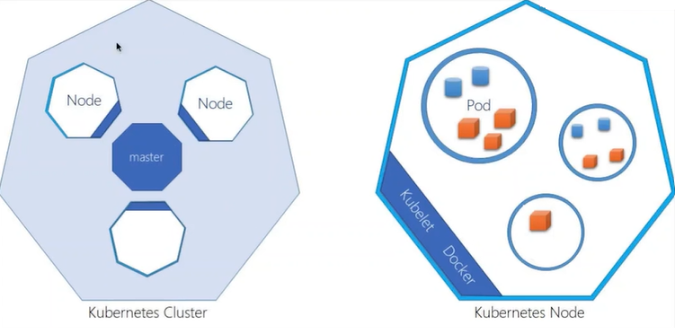
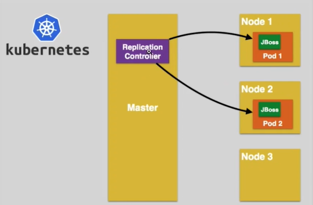

# Google Kubernetes Engine (GKE)

- O Google Kubernetes Engine é um serviço fornecido pela Google Cloud Plataform, que permite implantar e operar aplicativos baseados em containers em escala, utilizando a infraestrutura da provedora e gerenciá-los através do Kubernetes.

- Para a realização do curso é necessária a criação de uma conta na Google Cloud Plataform. Caso seja um novo cadastro, a plataforma oferece por tempo limitado uma quantidade de créditos para uso.
  - A plataforma também oferece uma série de serviços de forma gratuíta com limites de consumo. Caso esses sejam ultrapassados, cobranças no cartão de crédito cadastrado na criação da conta podem ser realizadas.

- É necessária a criação de um projeto e ativação das APIs que serão utilizadas no mesmo.

- A plataforma permite manipulação via linha de comando, como os terminais em sistemas operacionais, através do **Cloud Shell**, além de um editor de arquivos, similar ao Visual Studio Code.

## :one: Google Container Registry API


- Um dos serviços oferecidos pela plataforma é a criação de um Container Registry para armazenar as imagens que serão utilizadas para criar nossos containers, similar ao Docker Hub.

- Após criar a imagem, é necessário inserir a seguinte Tag:

  ```Docker
      docker image tag <nome-imagem> gcr.io/<id-projeto>/<nome imagem>
  ```

  - É necessário inserir o id do projeto na tag das imagens, caso contrário, o Registry não será capaz de associá-las ao mesmo e não será possível acessá-las quando necessário.

  - Para descobrir o identificador do projeto:

    ```Google Cloud
        gcloud projects list
    ```

- Para enviar a imagem criada para o Registry:

    ```Docker
        docker image push gcr.io/<nome-projeto>/<nome-imagem>
    ```

- Na página do Registry, é possível visualizar todas as imagens armazenadas e até mesmo instanciá-las se desejado.

- O Container Registry será descontinuado e substituído pelo **Artifact Registry**.

## :two: Kubernetes Engine API


- Esse serviço permite o gerenciamento de containers utilizando uma implementação do orquestrador Kubernetes na Google Cloud Plataform.

### :arrow_right: Tipos de Cluster



- Relembrando: Um **Cluster** é formado por **Nodes**, que podem ser de dois tipos: os **Master**, responsáveis por coordenar os denominados **Slaves**, que armazenam os **Pods** das nossas aplicações. Esses Nodes podem ser tanto máquinas físicas quanto virtuais ou até mesmo poder computacional (é possível reservar uma ou mais CPUs para um único Node).

- Os recursos da Google Cloud Plataform são distribuídos entre regiões e zonas, permitindo a redundância das aplicações hospedadas no serviço. As regiões representam localizações geográficas, como por exemplo, Costa Oeste dos Estados Unidos e dentro dessas existem as zonas.
  - É importante saber que existem dois tipos de Cluster: regionais e zonais.
  - Os **Clusters Regionais** disponibilizam o plano de controle (ou nó Master) e os nós que contém nossas aplicações em diferentes zonas da mesma região, gerando uma redundância. Caso uma das zonas pare de funcionar, as demais suprirão a ausência até que a mesma seja reestabelecida, sendo transparente para o usuário.
  - Os **Clusters Zonais** podem ser formados por uma ou mais zonas de uma mesma região. A diferença nesse caso é que o plano de controle estará disponível em apenas uma delas. Caso a mesma sofra algum problema, nossa aplicação ficará indisponível;
  - É recomendado o uso de Clusters Regionais para aplicações em ambiente produtivo.

### :arrow_right: Criando um Cluster

- Para criar um Cluster, é necessário definir se ele será criado no modo **Standard** (Padrão) ou **Autopilot** (Piloto Automático). Em ambos os casos é necessário definir a região e zona das máquinas virtuais que armazenarão os Nodes serão alocadas, além de configurações de rede.

- No modo Padrão, é necessário definir uma série de configurações do Cluster, como o número de Nodes (é possível limitar o número máximo de Pods por Node), o tipo das máquinas virtuais e a quantidade de recurso computacional que será alocado para elas. No modo Piloto Automático, o próprio serviço trata de alocar os recursos para a aplicação conforme necessidade.

- No modo Padrão o custo é calculado por Node, enquanto no Automático é por Pod.

- No exemplo apresentado abaixo, foi criado um Cluster com três Nodes (valor padrão) e podemos visualizar em **Nós** que de fato são alocadas três máquinas virtuais:

  

  - Se acessarmos o serviço **Compute Engine**, onde são listadas todas as máquinas virtuais do projeto, é possível visualizá-las também. Porém, se o Cluster for criado no Piloto Automático, essas máquinas virtuais não ficam visíveis para o usuário.

- O próprio Google Cloud Plataform fornece uma calculadora que possibilita o usuário simular os diferentes cenários de configuração do Cluster, e visualizar as estimativas de gasto que o mesmo teria.

### :arrow_right: Criando Pods

#### :arrow_right::arrow_right: Interface Gráfica

- Para criar um Pod via interface gráfica, é necessário acessar a página da Google Container Registry API, selecionar a imagem e a versão que desejamos instanciar, clicar em **Implantar** e na opção **Implantar no GKE**:

  

- Selecionar a partir imagem que deseja instanciar (Nesse caso, como a opção de implantar foi executada já de dentro da imagem, por padrão ela será selecionada) e variáveis de ambiente, caso necessário:

  

- Definir o nome do Pod, seu namespace e em que Cluster ele será criado:

  

- Criar o Service que irá expor o Pod, definindo a porta exposta, a de destino, o protocolo utilizado e o tipo do Service:

  

- Por fim, clicar em **Implantar** e esperar que o GKE crie o Pod conforme configurado.

#### :arrow_right::arrow_right: Linha de Comando

- O processo para criação de Pods via linha de comando é o mesmo já visto nos cursos introdutórios de Kubernetes. A única diferença é que eles serão criados no Cluster alocado na nuvem e não localmente.

- É possível fazer isso diretamente pelo terminal da máquina local ou pelo Cloud Shell, vai depender de onde os arquivos de configuração estiverem alocados.

- Caso o processo seja realizado via máquina host, é necessário primeiramente instalar o *client* do Google Cloud Plataform e em seguida realizar a autenticação:

  - Solicitar login:

    ```Google Cloud
      gcloud auth login
    ```

  - Nesse momento o browser será aberto e a janela direcionada para a página de autenticação do Google Cloud Platform. Após a autenticação, um código será disponibilizado e o mesmo deve ser inserido no terminal quando solicitado. A partir desse momento, você estará conectado ao provedor através do client do seu terminal.

  - Alterar o projeto corrente:

    ```Google Cloud
      gcloud config set project <id-projeto>
    ```

- Independente de onde o processo esteja sendo realizado, é necessário baixar as credenciais do cluster onde o Pod será criado, permitindo manipulá-lo via linha de comando. É possível obter o exato comando que deve ser realizado acessando a página do Google Kubernetes Engine, selecionando o Cluster onde deseja alocar o Pod e clicando em **Conectar**.

  

- Após inserir o comando obtido no terminal e executá-lo, será possível manipular o Cluster a partir do terminal utilizando os comandos do `kubectl` já conhecidos.

#### :arrow_right: Alocação de Pods em Nodes



- Relembrando: O **Node Master** é responsável por alocar os **Pods** nos Nodes do **Cluster** através do **Scheduler**.

- Na imagem abaixo vemos um Deployment com 3 réplicas, onde cada um dos Pods é armazenada em um Node diferente, garantindo a redundância da aplicação:

  

#### :arrow_right: Manipulando Deployments

- Na imagem abaixo podemos visualizar o comando `kubectl get nodes` sendo executado diretamente no terminal da máquina local e exibindo os três Nodes do Cluster criado na nuvem.

  

- Na seção "Cargas de Trabalho", dentro do GKE, podemos visualizar nossos Pods existentes no Cluster:

  

- Se entrarmos na página destinada ao nosso Deployment, podemos visualizar diversas informações sobre ele, como os Pods que o compõe:

  

#### :arrow_right: Criando Service

- No exemplo apresentado, o Pod foi criado sem expô-lo através de um serviço. É possível fazer isso através da interface do GKE:

  

- Na sequência é necessário indicar a porta exposta e a porta de destino, além do tipo do Service (**ClusterIP**, **NodePort** ou **Load Balancer**) e clicar em **Expor**:

  

- Outra opção é clicar em **Ver YAML** e selecionar o conteúdo, inserí-lo em um arquivo `.yaml` e criar o Service do modo convencional através da linha de comando utilizando o comando `kubectl apply -f <nome-arquivo>.yaml`:

  

- Na seção **Serviços e entradas** podemos visualizar todos os Services criados no nosso Cluster e em **Pontos de extremidade** o endpoint para acessarmos nossa aplicação:

  

#### :arrow_right: Visualizando Eventos

- Para visualizar eventos que ocorreram dentro de um Pod executamos o seguinte comando:

  ```Google Cloud
    kubectl describe pod <nome-pod>
  ```

- Porém, podemos visualizar essas mesmas informações acessando o Pod, via interface Gráfica do GKE, e indo na aba **Eventos**:

  

- O mesmo serve para outras funcionalidades, como Deployments e Services.

- É possível visualizar todos os eventos do Cluster de uma só vez:

  ```Google Cloud
    kubectl get events
  ```

#### :arrow_right: Visualizando Logs

- Para visualizar os logs de um Pod, executamos o seguinte comando:

  ```Google Cloud
    kubectl logs pod/<nome-pod>
  ```

- Porém, podemos visualizar essas mesmas informações acessando o Pod, via interface Gráfica do GKE, e indo na aba **Registros**:

  
