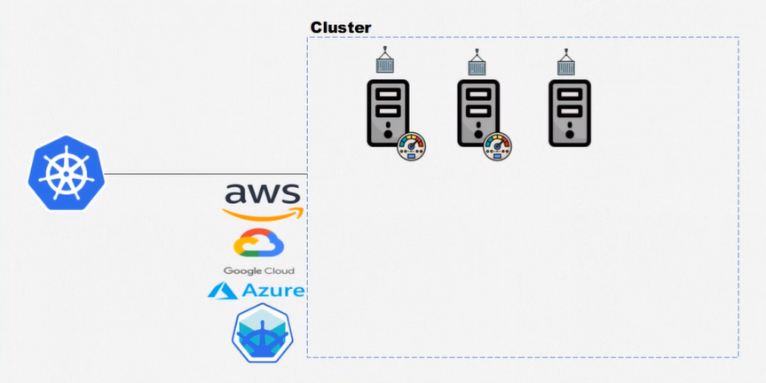
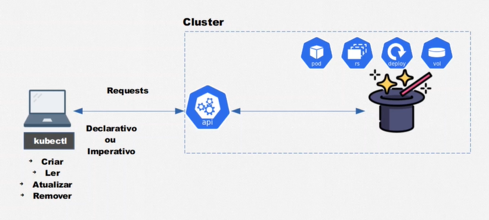

# Kubernetes - Pods, Services, ConfigMaps

## :one: Contextualização



- Seja a situação onde temos uma aplicação conteinerizada, disponibilizada através de um servidor, esteja ele em seu domínio ou de uma provedora de serviço de nuvem, como AWS, Google Cloud ou Azure. Caso essa aplicação comece a consumir mais recursos computacionais do que a máquina dispõe, precisamos aumentá-los. Esse conceito chama-se **escalabilidade**.

- Podemos escalar uma aplicação de duas formas: **verticalmente**, onde aumentamos os recursos computacionais da máquina no qual a aplicação está alocada, como memória, processamento, armazenamento, etc.; ou **horizontalmente**, onde adicionamos mais máquinas que irão executar a aplicação em paralelo, balanceando a carga de trabalho.

- Nossa solução foi escalar horizontalmente a aplicação. Porém, outro problemas podem surgir:
  - Pode ser que em um determinado momento, mesmo com duas máquinas executando a nossa aplicação, seja necessário adicionar uma terceira ou até mesmo quarta máquina e alocarmos novas instâncias dos containeres neles, pois a demanda está aumentando;
  - Outro problema é a necessidade de ser realizar balanceamento de carga entre as máquinas;
  - Caso o container de uma das máquinas pare de funcionar (o termo mais comum de ser utilizado é o container cair), a outra irá suprir a ausência, porém, em algum momento aquele que caiu deve ser restabelecido.

- O Kubernetes permite que tratemos todas essas questões de forma fácil e automatizada.

- É possível criar um espaço lógico, denominado **Cluster**, que agrupa todos essas máquinas disponibilizadas para a aplicação e que devem atuar em conjunto, para gerenciá-los. Esse agrupamento permite que o Kubernetes realize automaticamente o balanceamento de carga entre as máquinas, as escale conforme a necessidade, reinicie containeres que por algum motivo pararam de funcionar, etc.

## :two: Arquitetura


- O Kubernetes não é um simples orquestrador de containeres. Ele possui recursos (*resources*) prontos que nos permitem realizar determinadas tarefas, sem a necessidade de implementarmos tudo do zero. Exemplo:
  - Caso desejemos lidar com persistência de dados, podemos utilizar o recurso de *Persistent Volume* (PV);
  - Caso precisemos utilizar um container, devemos utilizar o recurso de *Pods*, que permite encapsulá-los e manipulá-los pelo Kubernetes.

- *Spoiler:* O Kubernetes não mexe diretamente com containeres. Ele os encapsula em estruturas chamadas *Pods* que permite manipulá-los e ter mais "poderes" sobre eles.

- Utilizando esses recursos, conseguimos criar aplicações bem elaboradas: o *Service* (SVC) recebe um tráfego de dados e realiza o balanceamento de carga entre os *Pods*, que podem estar sendo gerenciados por um ReplicaSet (RS), que pode estar sendo gerenciado por um Deployment (DEPLOY), e esses *Pods* podem ser escalados horizontalmente utilizando o *Horizontal Pod AutoScaler* (HPA). Tudo vai depender de utilizarmos os recursos corretos.

- Todos esses recursos serão vistos com mais detalhes.


- As máquinas que compõe um Cluster podem ser divididas em dois grupos: **Master** e **Node**.

- As máquinas Master são responsáveis por gerenciar o cluster, manter e atualizar o estado desejado e receber e executar novos comandos.
  - Se um Pod cair sem que tenha sido enviado qualquer comando para derrubá-lo, ele é responsável por identificar essa inconsistência e reestabelecê-lo;
  - Caso o usuário deseje executar um comando, por exemplo, criar uma nova funcionalidade dentro do Cluster, o Master será responsável por receber esse comando, interpretá-lo e executá-lo.

- As máquinas Nodes são responsáveis por executar as aplicações, isto é, os Pods que encapsulam os containeres que compõe a aplicação.


- Podemos entrar um pouco mais a fundo e perceber que essas máquinas Master e Node possuem recursos responsáveis por diferentes tarefas.

- No caso dos nós Master (esses quatro recursos formam o *Control Plane*):
  - **API**: Responsável pela comunicação entre os componentes e por receber as requisições externas;
  - **Control Manager:** Responsável por manter e atualizar o estado desejado;
  - **Scheduler:** Responsável por determinar em que máquina do Cluster será alocado o Pod;
  - **ETCD:** Responsável por armazenar os dados vitais referentes ao cluster em um banco do tipo chave-valor.

- No caso dos nós Node:
  - **Kubelet:** Responsável pela execução dos Pods dentro dos Nodes;
  - **K-Proxy:** Responsável pela comunicação entre os Nodes do Cluster.



- Para nos comunicarmos com a API e realizarmos comandos, utilizamos o `kubectl`, onde enviamos *requests*, isto é, comandos de criação, leitura, atualização ou remoção, para manipular os recursos existentes no Cluster.

- Essas *requests* podem ser enviadas de forma declarativa, através de arquivos onde especificamos o que queremos que aconteça; ou de forma imperativa, enviando comandos.

## :three: Criando o Cluster

### :arrow_right: Windows

- Basta instalar o Docker Desktop e ir em suas configurações e habilitar o Kubernetes. A partir de então o kubectl estará disponível através da linha de comando e automaticamente um cluster será criado e seus Nodes podem ser visualizados a partir do seguinte comando:

  ```Windows
    kubectl get nodes
  ```

### :arrow_right: Linux

- Nesse caso é necessário instalar o kubectl manualmente.

- Para a criação do Cluster é necessário instalar o **Minikube**, uma ferramenta que permite a criação de um Cluster local de forma virtualizada.

- Para iniciar o Minikube, deve-se apontar um driver de virtualização. Nesse caso, uma alternativa é baixar o VirtualBox na sua máquina (ou qualquer outra ferramenta de virtualização a sua escolha) e executar o seguinte comando:

  ```Bash
    minikube start --vm-driver=virtualbox
  ```

- A partir de então o Cluster estará criado e seus Nodes podem ser visualizados utilizando o mesmo comando do Windows.
